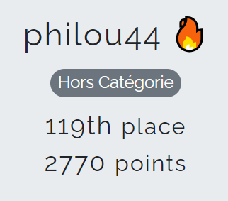
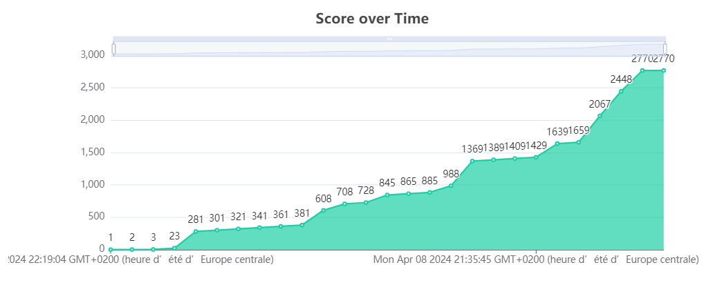

# FCSC-2024-writeup

Voici les réflexions menées pour résoudre certains des challenges proposés lors du **FCSC 2024**. 
Le CTF s'est déroulé du 5 au 14 avril 2024 en ligne et a réuni 1434 compétiteurs.

NB : On peut retrouver les différents challenges, ainsi que ceux des éditions précédentes sur le site [Hackropole](https://hackropole.fr/).

## Résultat obtenu

<table>
  <tbody>
    <tr>
      <td></td>
      <td></td>
    </tr>
  </tbody>
</table>

## Challenges résolus

<table>
 <thead><tr><th>Catégorie</th><th>Challenge</th><th>Niveau</th><th>Points obtenus</th><th>Résolutions</th></tr></thead>
 <tbody>
  <tr><td rowspan=3>crypto</td>
        <td><a href="./crypto/adveRSArial-crypto-baby/adveRSArial-crypto-baby.md">AdveRSArial Crypto (Baby)</a></td><td>:star:</td><td>258</td><td>113</td></tr>
    <tr><td><a href="./crypto/el-gamal-fait-1_2/el-gamal-fait-1_2.md">El Gamal Fait 1/2</a></td><td>:star:</td><td>227</td><td>131</td></tr>
    <tr><td><a href="./crypto/el-gamal-fait-2_2/el-gamal-fait-2_2.md">El Gamal Fait 2/2</a></td><td>:star:</td><td>381</td><td>50</td></tr>
  <tr><td rowspan=4>misc</td>
        <td><a href="./misc/illuminated/illuminated.md">Illuminated</a></td><td>:star:</td><td>322</td><td>78</td></tr>
    <tr><td><a href="./misc/puzzle-trouble-1_2/puzzle-trouble-1_2.md">Puzzle Trouble 1/2</a></td><td>:star:</td><td>100</td><td>407</td></tr>
    <tr><td><a href="./misc/puzzle-trouble-2_2/puzzle-trouble-2_2.md">Puzzle Trouble 2/2</a></td><td>:star: :star: :star:</td><td>117</td><td>240</td></tr>
    <tr><td><a href="./misc/tortuga/tortuga.md">Tortuga</a></td><td>:star:</td><td>103</td><td>277</td></tr>
  <tr><td rowspan=1>reverse</td>
        <td><a href="./reverse/fifty-shades-of-white-pinkman/fifty-shades-of-white-pinkman.md">Fifty Shades of White (Pinkman)</a></td><td>:star:</td><td>210</td><td>144</td></tr>
  <tr><td rowspan=2>web</td>
        <td><a href="./web/abyssal-odds/abyssal-odds.md">Abyssal Odds</a></td><td>:star:</td><td>381</td><td>49</td></tr>
    <tr><td><a href="./web/welcome-admin-2_2/welcome-admin-2_2.md">Welcome Admin 2/2</a></td><td>:star:</td><td>408</td><td>37</td></tr>
  <tr><td rowspan=13>intro</td>
        <td><a href="./intro/adveRSArial-crypto-infant/adveRSArial-crypto-infant.md">AdveRSArial Crypto (Infant)</a></td><td></td><td>20</td><td>292</td></tr>
    <tr><td><a href="./intro/blind-attack/blind-attack.md">Blind Attack</a></td><td></td><td>20</td><td>171</td></tr>
    <tr><td><a href="./intro/call-me-blah/call-me-blah.md">Call Me Blah</a></td><td></td><td>20</td><td>79</td></tr>
    <tr><td><a href="./intro/fftea/fftea.md">FFTea</a></td><td></td><td>20</td><td>154</td></tr>
    <tr><td><a href="./intro/fifty-shades-of-white-junior/fifty-shades-of-white-junior.md">Fifty Shades of White (Junior)</a></td><td></td><td>20</td><td>236</td></tr>
    <tr><td><a href="./intro/integration-par-parties/integration-par-parties.md">Intégration par parties</a></td><td></td><td>20</td><td>42</td></tr>
    <tr><td><a href="./intro/layer-cake-1_3/layer-cake-1_3.md">Layer Cake 1/3</a></td><td></td><td>20</td><td>541</td></tr>
    <tr><td><a href="./intro/layer-cake-2_3/layer-cake-2_3.md">Layer Cake 2/3</a></td><td></td><td>20</td><td>373</td></tr>
    <tr><td><a href="./intro/layer-cake-3_3/layer-cake-3_3.md">Layer Cake 3/3</a></td><td></td><td>20</td><td>265</td></tr>
    <tr><td><a href="./intro/rien-a-signaler/rien-a-signaler.md">Rien à signaler</a></td><td></td><td>20</td><td>391</td></tr>
    <tr><td><a href="./intro/strike/strike.md">Strike</a></td><td></td><td>20</td><td>95</td></tr>
    <tr><td><a href="./intro/very-cute-data/very-cute-data.md">Very Cute Data</a></td><td></td><td>20</td><td>127</td></tr>
    <tr><td><a href="./intro/welcome-admin-1_2/welcome-admin-1_2.md">Welcome Admin 1/2</a></td><td></td><td>20</td><td>659</td></tr>
  <tr><td rowspan=4>welcome</td>
        <td><a href="./welcome/prechall/prechall.md">Prechall FCSC 2024</a></td><td></td><td>1</td><td>97</td></tr>
    <tr><td><a href="./welcome/docker-et-netcat/docker-et-netcat.md">Docker et Netcat</a></td><td></td><td>1</td><td>802</td></tr>
    <tr><td><a href="./welcome/reseaux-sociaux/reseaux-sociaux.md">Réseaux sociaux</a></td><td></td><td>1</td><td>819</td></tr>
    <tr><td><a href="./welcome/feedback/feedback.md">Feedback</a></td><td></td><td>0</td><td>46</td></tr>
 </tbody>
</table>
