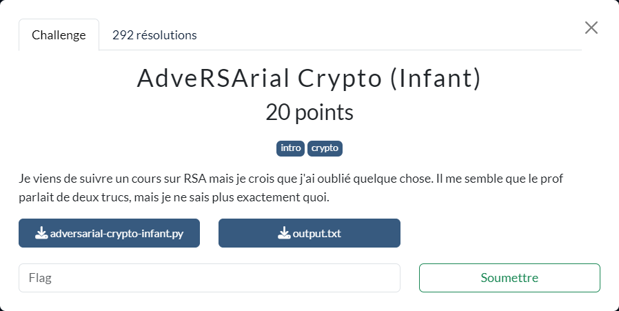

# AdveRSArial Crypto (Infant)

Les fichiers fournis :
- [adversarial-crypto-infant.py](adversarial-crypto-infant.py)
- [output.txt](output.txt)

----

Le script `adversarial-crypto-infant.py` effectue un chiffrement RSA du fichier `flag.txt` et fournit en sortie dans le fichier `output.txt` :
- `c` : le flag chiffré
- `n` : le module de chiffrement
- `e` : l'exposant de chiffrement

Sauf que le module de chiffrement `n` utilisé est ici directement un nombre premier, et non un facteur de deux nombres premiers. Par conséquent la factorisation de `n` est évidente :smile:

On peut alors facilement déterminer `d` l'exposant de déchiffrement et par suite le flag :

$$
d \equiv e^{-1} \pmod{n-1}
\Rightarrow
flag \equiv c^{d} \pmod{n}
$$

On utilise le script [`adversarial-crypto-infant-solve.py`](./adversarial-crypto-infant-solve.py) pour procéder au déchiffrement.
