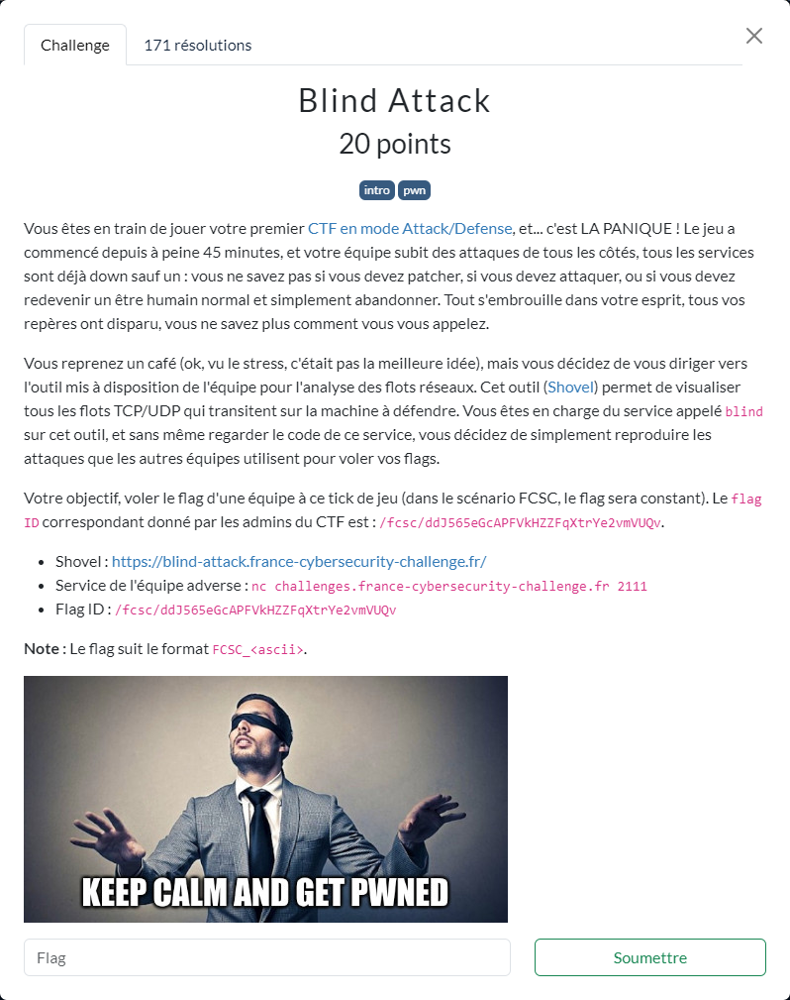

# Blind Attack



----

Sur shovel, on récupère le script associé à : https://blind-attack.france-cybersecurity-challenge.fr/?flow=1072027433827877&tag=FLAG+OUT
pour lequel le flag a été récupéré (car taggué FLAG_OUT).

Dans ce script [`blind-attack.py`](./blind-attack.py), on fait quelques ajustements afin de récupérer le flag associé à l'ID `ddJ565eGcAPFVkHZZFqXtrYe2vmVUQv` :

```sh
$ python3 blind-attack.py
[+] Opening connection to challenges.france-cybersecurity-challenge.fr on port 2111: Done
b'FCSC_47d5ba1574be11ecbbfdcfac58fa8e8dcc8f010894f79b8615e4d746bc857d80\x00'
[*] Closed connection to challenges.france-cybersecurity-challenge.fr port 2111
```
