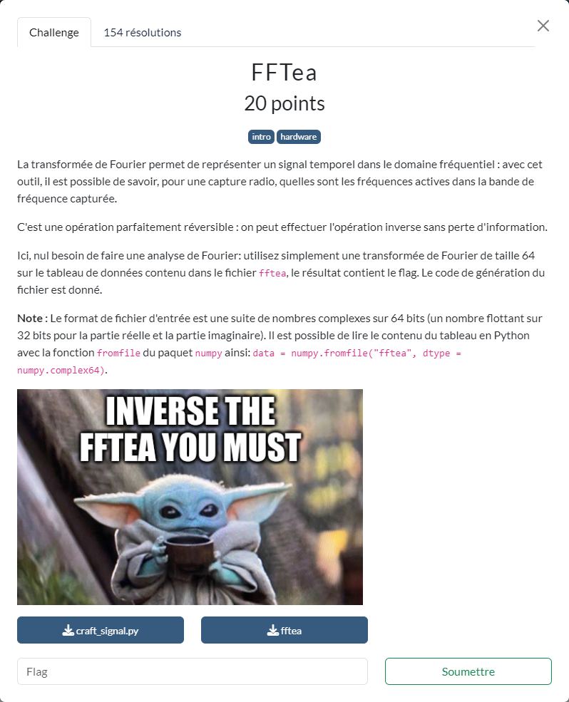

# FFTea



Les fichiers fournis :
- [craft_signal.py](craft_signal.py)
- [fftea](fftea)

----

On suit simplement les indications de l'énoncé, en appliquant la DFT (Discrete Fourier Transform) sur les données fournies dans le fichier `fftea`.

Le script [`read_data.py`](./read_data.py) effectue les différentes opérations permettant de récupérer le flag :

```sh
$ python3 read_data.py
flag='FCSC{5b969113668d7fc28fe1a7d07183eea4de5458dd1027d6f29c24350a10}'
```
