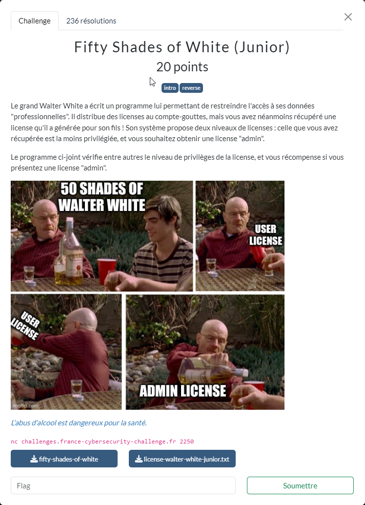

# Fifty Shades of White (Junior)



Les fichiers fournis :
- [fifty-shades-of-white](fifty-shades-of-white)
- [license-walter-white-junior.txt](license-walter-white-junior.txt)

----

### 1. Analyse des éléments fournis

La décompilation de `fifty-shades-of-white` avec Ghidra, montre au niveau de la fonction `main` :
- que le binaire attend 1 paramètre
- que ce paramètre doit correspondre à un nom de fichier de licence
- un `parse` du fichier est réalisé afin de vérifier que le format est correct et en récupérer le contenu.
- puis un `check` afin de contrôler l'intégrité du contenu

```c
undefined8 main(int param_1,undefined8 *param_2)
{
  int iVar1;
  void *local_28;
  void *local_20;
  
  if (param_1 != 2) {
    printf("Usage: %s <license.txt>\n",*param_2);
                    /* WARNING: Subroutine does not return */
    exit(1);
  }
  iVar1 = parse(param_2[1],&local_28);
  if (iVar1 == 0) {
    puts("Invalid license!");
  }
  else {
    check(&local_28);
    free(local_28);
    free(local_20);
  }
  return 0;
}
```

----

Commençons par analyser un peu plus la fonction `parse`.

Le fichier de licence doit respecter le format suivant :
- commencer par le header `----BEGIN WHITE LICENSE----`
- finir par le footer `-----END WHITE LICENSE-----`, suivi d'une ligne vide
- entre les 2, la charge utile encodée en base64.

Une fois décodée, la charge utile doit être composée de 3 lignes :
- `Name` : la personne à qui la licence est accordée
- `Serial` : le numéro de la licence
- `Type` : le type de licence

Pour le fichier `license-walter-white-junior.txt` fourni les données sont :

```txt
Name: Walter White Junior
Serial: 1d117c5a-297d-4ce6-9186-d4b84fb7f230
Type: 1
```

----

Continuons par l'analyse de la fonction `check` :

```c
void check(undefined8 *param_1)
{
  int iVar1;
  
  iVar1 = validate(*param_1,param_1[1]);
  if (iVar1 == 0) {
    puts("Invalid license!");
  }
  else if (*(int *)(param_1 + 2) == 1) {
    printf("Valid license for %s!\n",*param_1);
  }
  else if (*(int *)(param_1 + 2) == 0x539) {
    printf("Valid admin license for %s!\n",*param_1);
    show_flag();
  }
  else {
    puts("Invalid license, but nice try! Here: https://www.youtube.com/watch?v=dQw4w9WgXcQ");
  }
  return;
}
```

Une petite pause musicale offerte par notre cher ami Rick Astley : https://www.youtube.com/watch?v=dQw4w9WgXcQ. Ce serait dommage de ne pas en profiter.

Une analyse rapide de `validate` montre que la licence est valide s'il existe une certaine correspondance entre les 2 champs `Name` et `Serial`. Cette validation ne s'appuie aucunement sur le `Type`.

En cas de licence valide, sa nature est définie en fonction du `Type` avec les correspondances suivantes :
- `1` : pour une licence standard
- `0x539` (i.e. `1337`) : pour une licence admin

L'obtention du flag, via la fonction `show_flag` nécessite d'avoir une licence admin.

----

### 2. Expérimentation rapide

On commence par expérimenter en local le fichier `fifty-shades-of-white` :

```sh
$ fifty-shades-of-white
Usage: ./fifty-shades-of-white <license.txt>
$ fifty-shades-of-white license-walter-white-junior.txt
Valid license for Walter White Junior!
```

Puis sur le serveur :

```sh
nc challenges.france-cybersecurity-challenge.fr 2250
[*] Send empty lines to mark the end of your inputs.
[*] Give me a valid admin license for username: Walter White Junior
```

On doit donc fournir une licence admin valide pour *Walter White Junior*.

On dispose bien d'une licence pour *Walter White Junior*, mais il ne s'agit que d'une licence standard.

----

### 3. Forgeage d'une licence admin

Suite aux analyses précédentes du code décompilé, on sait qu'une simple modification du `Type` n'en altère pas la validité (établie par la fonction `validate`).

On peut donc forger une licence admin pour *Walter White Junior*, juste en passant le `Type` de `1` à `1337` :

```txt
Name: Walter White Junior
Serial: 1d117c5a-297d-4ce6-9186-d4b84fb7f230
Type: 1337
```

Il ne reste plus qu'à encoder le contenu en base64 et rajouter le header et le footer, pour obtenir une licence valide.

A noter que la fonction de décodage base64 uilisée `b64d` sautant les `\n`, on n'est pas obligé de faire un retour à la ligne tous les 27 caractères. Par conséquent, les 2 fichiers suivants sont équivalents :

```txt licence-admin-format2.txt
----BEGIN WHITE LICENSE----
TmFtZTogV2FsdGVyIFdoaXRlIEp
1bmlvcgpTZXJpYWw6IDFkMTE3Yz
VhLTI5N2QtNGNlNi05MTg2LWQ0Y
jg0ZmI3ZjIzMApUeXBlOiAxMzM3
Cg==
-----END WHITE LICENSE-----

```


```txt licence-admin-format1.txt
----BEGIN WHITE LICENSE----
TmFtZTogV2FsdGVyIFdoaXRlIEp1bmlvcgpTZXJpYWw6IDFkMTE3YzVhLTI5N2QtNGNlNi05MTg2LWQ0Yjg0ZmI3ZjIzMApUeXBlOiAxMzM3Cg==
-----END WHITE LICENSE-----

```

----

### 4. Exploit

On commence par vérifier en local que la licence forgée est correcte :

```sh
$ fifty-shades-of-white licence-admin-format1.txt
Valid admin license for Walter White Junior!
Send this license to the remote service to grab the flag of the junior challenge!
```

Avant de l'utiliser sur le serveur distant :

```sh
$ cat licence-admin-format1.txt - | nc challenges.france-cybersecurity-challenge.fr 2250
[*] Send empty lines to mark the end of your inputs.
[*] Give me a valid admin license for username: Walter White Junior

Valid admin license for Walter White Junior!
Well done! Here is the flag for the Junior challenge:
FCSC{2053bb69dff8cf975c1a3e3b803b05e5cc68933923aabdd6179eace1ece0c41a}
```
