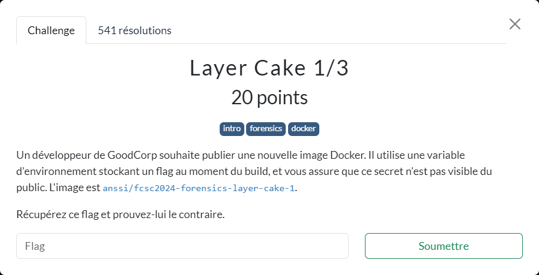

# Layer Cake 1/3



----

Si le flag est fourni via l'option `--build-arg` lors du build de l'image alors la consultation de l'historique de l'image permet d'en retrouver la valeur :

```sh
{ ~ }  » docker pull anssi/fcsc2024-forensics-layer-cake-1

{ ~ }  » docker history anssi/fcsc2024-forensics-layer-cake-1 --no-trunc --format '{{.CreatedBy}}'
CMD ["/bin/sh"]
USER guest
ARG FIRST_FLAG=FCSC{a1240d90ebeed7c6c422969ee529cc3e1046a3cf337efe51432e49b1a27c6ad2}
/bin/sh -c #(nop)  CMD ["/bin/sh"]
/bin/sh -c #(nop) ADD file:37a76ec18f9887751cd8473744917d08b7431fc4085097bb6a09d81b41775473 in /
```
