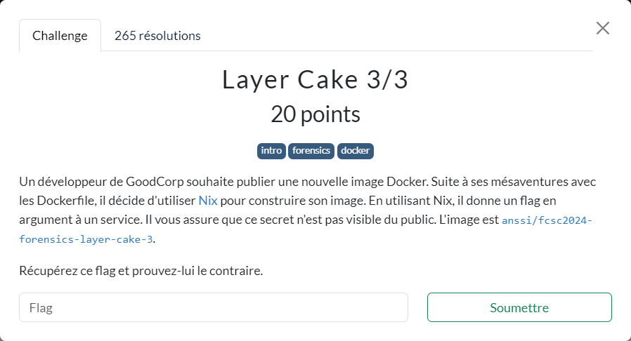

# Layer Cake 3/3



----

Aidé par l'énoncé, on commence par regarder quelle est la commande utilisée au démarrage du container :

```sh
{ ~ }  » docker pull anssi/fcsc2024-forensics-layer-cake-3

{ ~ }  » docker inspect anssi/fcsc2024-forensics-layer-cake-3 --format '{{.Config.Cmd }}'
[/nix/store/m8ww0n3iqndg8zaiwbsnij6rvmpmjbry-hello/bin/hello]
```

On va donc maintenant se focaliser à la récupération du contenu du script `/nix/store/m8ww0n3iqndg8zaiwbsnij6rvmpmjbry-hello/bin/hello`.

Comme lors de [Layer Cake 2/3](../layer-cake-2_3/layer-cake-2_3.md), on commence pour récupérer l'image sous forme d'archive :

```sh
{ ~ }  » docker save anssi/fcsc2024-forensics-layer-cake-3 -o fcsc2024-forensics-layer-cake-3.tar
```

On y trouve alors le fichier `b27944d1020a3fe70a1073f9976fe560782794464e6ad85ff6e8982588dad42f/layer.tar/nix/store/m8ww0n3iqndg8zaiwbsnij6rvmpmjbry-hello/bin/hello` contenant :

```sh
#!/nix/store/5lr5n3qa4day8l1ivbwlcby2nknczqkq-bash-5.2p26/bin/bash
exec /nix/store/rnxji3jf6fb0nx2v0svdqpj9ml53gyqh-hello-2.12.1/bin/hello -g "FCSC{c12d9a48f1635354fe9c32b216f144ac66f7b8466a5ac82a35aa385964ccbb61}" -t
```
