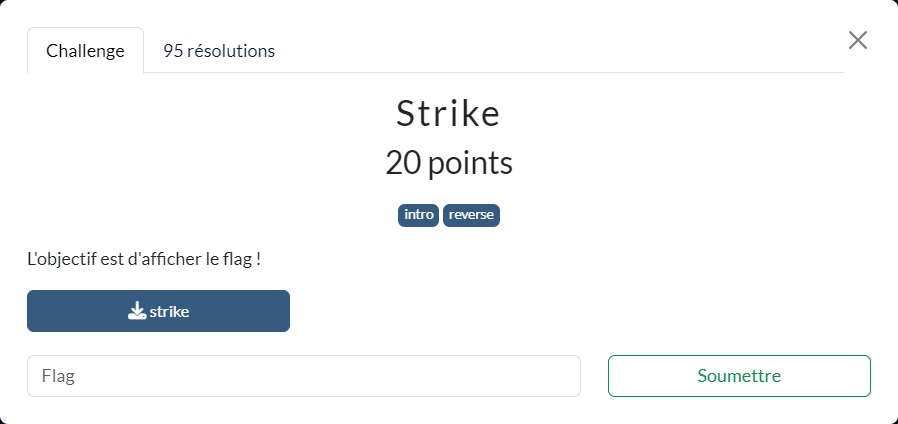

# Strike



Les fichiers fournis :
- [strike](strike)

----

Le fichier `strike` fourni est un exécutable 64 bits :

```sh
$ file ./strike
./strike: ELF 64-bit LSB pie executable, x86-64, version 1 (SYSV), dynamically linked, interpreter /lib64/ld-linux-x86-64.so.2, BuildID[sha1]=def8ccb1e50d06bd0adbfe795a02af40b9cf6ee4, for GNU/Linux 3.2.0, not stripped
```

La décompilation de sa fonction `main` avec IDA Freeware donne :

```c
int __fastcall main(int argc, const char **argv, const char **envp)
{
  unsigned __int8 v4; // [rsp+17h] [rbp-19h] BYREF
  unsigned int size; // [rsp+18h] [rbp-18h]
  int size_4; // [rsp+1Ch] [rbp-14h]
  void *s1; // [rsp+20h] [rbp-10h]
  unsigned int i; // [rsp+2Ch] [rbp-4h]

  s1 = 0LL;
  size_4 = -1;
  if ( argc == 2 )
  {
    size = strlen(argv[1]);
    if ( (size & 1) == 0 )
    {
      s1 = malloc(size);
      if ( s1 )
      {
        for ( i = 0; i < size; i += 2 )
        {
          if ( (unsigned int)a((unsigned __int8)argv[1][i], (unsigned __int8)argv[1][i + 1], &v4) || v4 > 0x23u )
            goto LABEL_12;
          *((_BYTE *)s1 + (i >> 1)) = charset[(i + v4) % 0x23];
        }
        if ( size - 162 <= 1 && !memcmp(s1, to_check, size >> 1) )
          size_4 = 0;
      }
    }
  }
LABEL_12:
  if ( s1 )
    free(s1);
  if ( size_4 )
    puts("[-] Error ...");
  else
    printf(format, argv[1]);
  return size_4;
}
```

On en déduit que :
- le binaire doit être appelé avec un seul argument : `if ( argc == 2 )`
- la taille de cet argument est paire : `if ( (size & 1) == 0 )`
- les caractères de cet argument sont lus 2 par 2 : `for ( i = 0; i < size; i += 2 )`
- puis, via la fonction `a`, leur contenu hexadécimal converti en entier
- que cet entier doit être inférieur à `0x23`,
    - donc que l'argument fourni en entré, est composé de caractères qui lus 2 par 2 doivent être tous compris entre `00` et `23`
- que cet entier sert à choisir un caractère parmi ceux de la liste `charset` qui vaut `abcdefghijklmnopqrstuvwxyz!# $:-().`
- ce caractère sert à constituer la chaine `s1`
- la chaine `s1` obtenue doit être `# congratulations! this is a strike :-) you should now see the flag printed ... #`

Le script [`strike.py`](./strike.py) permet de trouver l'argument à fournir pour que la condition sur `s1` soit valide.

On peut ensuite appeler `strike` avec celui-ci :

```sh
$ ./strike 1b1a2108051f051503021a0d1e111512151b1b10020109111e030b10071e1d190e0e061c1c1b1b140e02060c00161b1f140a21100f15190d201e11061b160913170a0e221313080b0f211e121614120a07
[+] Nice! The flag is: FCSC{1b1a2108051f051503021a0d1e111512151b1b10020109111e030b10071e1d190e0e061c1c1b1b140e02060c00161b1f140a21100f15190d201e11061b160913170a0e221313080b0f211e121614120a07}
```
