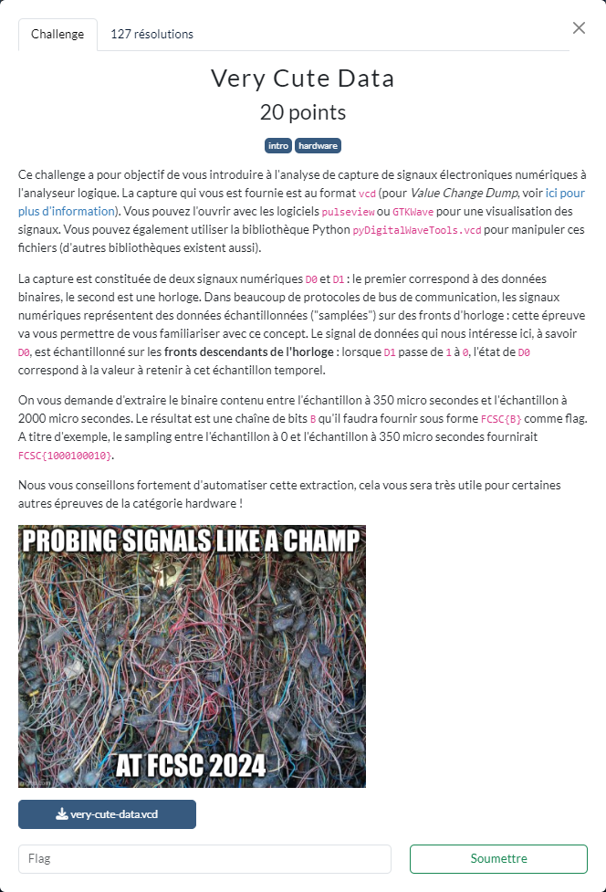

# Very Cute Data



Les fichiers fournis :
- [very-cute-data.vcd](very-cute-data.vcd)

----

L'implémentation dans le script [`very-cute.py`](./very-cute.py) des règles indiquées dans l'énoncé permet d'obtenir le flag :

```sh
$ python3 very-cute.py
flag=FCSC{0000000011000000000000000000000001000100010000011}
```
