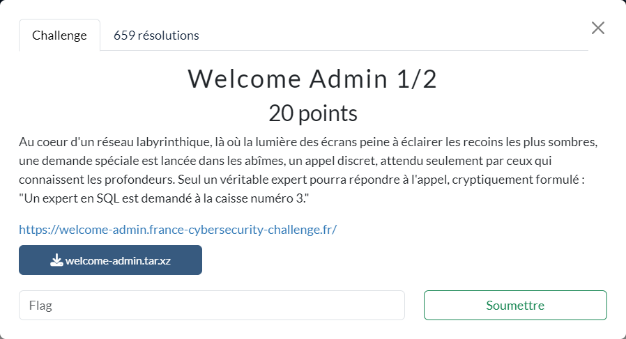

# Welcome Admin 1/2



Les fichiers fournis :
- [welcome-admin.tar.xz](welcome-admin.tar.xz)

----

L'archive fournie permet de démarrer le serveur en local après une légère adaptation du `docker-compose.yml` afin que les containers démarrent dans le bon ordre :

```diff docker-compose.yml
...
  welcome-admin:
    ...
+   depends_on:
+     - welcome-admin-db
...
```

En analysant le fichier source `welcome-admin.py` on voit qu'il y a 2 flags à trouver : 1 pour chacune des 2 étapes du challenge. Ici on va donc viser l'obtention du premier flag `FIRST_FLAG`.

Pour l'obtenir, il faut donc faire en sorte que la requête exécutée lors de l'appel à `/admin` ramène exactement 1 ligne :

```py
@app.route("/", methods=["GET", "POST"])
@login_for(Rank.GUEST, Rank.ADMIN, "/admin")
def level1(cursor: cursor, password: str):
    token = os.urandom(16).hex()
    cursor.execute(f"SELECT '{token}' = '{password}'")
    row = cursor.fetchone()
    if not row:
        return False
    if len(row) != 1:
        return False
    return bool(row[0])
```

Or la façon dont cette requête est construite permet d'exploiter une injection SQL.

Avec `password = ' or 1=1 --`, on voit alors le flag apparaître sur la page.
