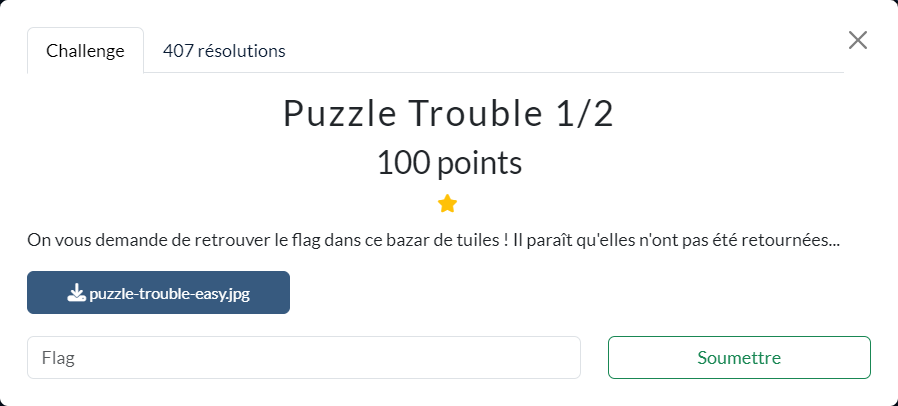

# Puzzle Trouble 1/2

Les fichiers fournis :
- [puzzle-trouble-easy.jpg](puzzle-trouble-easy.jpg)

----

La méthode utilisée pour résoudre ce challenge a été simplement de découper l'image en petits carrés et de la reconstituer morceau par morceau :

