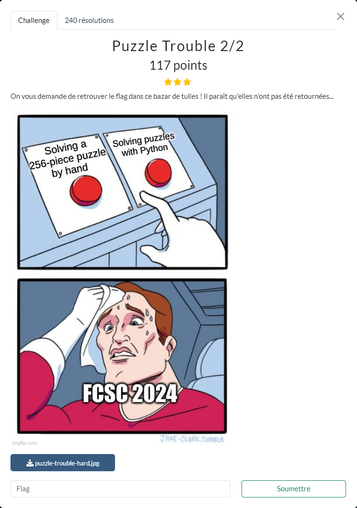

# Puzzle Trouble 2/2

Les fichiers fournis :
- [puzzle-trouble-hard.jpg](puzzle-trouble-hard.jpg)

----

La technique utilisée est similaire à celle utilisée pour résoudre [Puzzle Trouble 1/2](../puzzle-trouble-1_2/puzzle-trouble-1_2.md). Il faut juste un peu de patience, même si on n'est pas obligé de reconstituer entièrement l'image de départ pour obtenir le flag :

