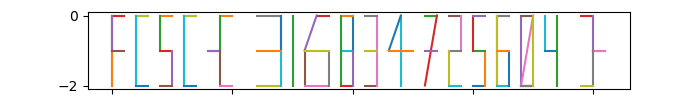

# Tortuga

Les fichiers fournis :
- [tortuga-example.png](tortuga-example.png)
- [tortuga-example.txt](tortuga-example.txt)
- [tortuga-flag.txt](tortuga-flag.txt)

----

Le script [`tortuga.py`](./tortuga.py) implémente les règles de déplacement indiquées dans l'énoncé, permettant ainsi de dessiner le flag :

