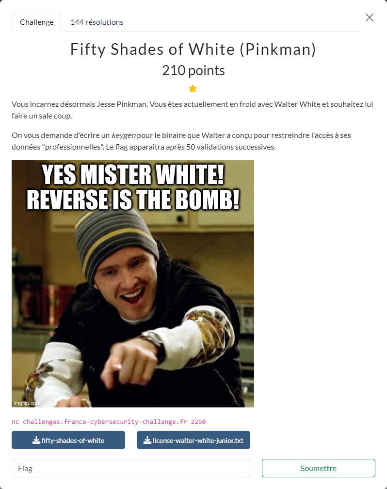

# Fifty Shades of White (Pinkman)



Les fichiers fournis :
- [fifty-shades-of-white](fifty-shades-of-white)
- [license-walter-white-junior.txt](license-walter-white-junior.txt)

----

Il s'agit de la suite du challenge [Fifty Shades of White (Junior)](../../intro//fifty-shades-of-white-junior/fifty-shades-of-white-junior.md).

A cette étape, on va devoir être capable de forger une licence valide, non plus juste en modifiant le `Type` de celle fournie en exemple, mais pour un autre `Name`.

Or on a vu précédemment qu'il semblait y avoir une certaine relation entre le `Name` et le `Serial`, et que celle-ci était vérifiée dans la fonction `validate`. Il va donc falloir analyser plus en détail l'algorithme de cette fonction dont voici un extrait (après renommage de certaines variables pour en faciliter la compréhension) :

```c
uint validate(char *name,char *serial)
{
  // .... déclaration des variables
  serial_length = strlen(serial);
  sha256(serial,serial_length,&serial_sha256,local_2c);
  license_valid = 1;
  for (i = 0; i < 3; i += 1) {
    code_ascii_sum = 0;
    j = (ulong)i;
    while( true ) {
      serial_length = strlen(name);
      if (serial_length <= j) break;
      code_ascii_sum += name[j];
      j += 3;
    }
    checksum_name = (code_ascii_sum * 0x13 + 0x37) % 0x7f;
    checksum_serial = ((uint)*(byte *)((long)i + (long)serial_sha256) * 0x37 + 0x13) % 0x7f;
    license_valid &= checksum_name == checksum_serial;
  }
  
  return license_valid;
}}
```

On a donc :
- `serial_sha256` qui contient le SHA-256 du `Serial`
- à partir du `Name`, une sorte de checksum `checksum_name` est calculé à partir des caractères en position 0, 3, 6, ...
- un checksum `checksum_serial` est également calculé en prenant le 1er octet de `serial_sha256`
- les 2 checksums ainsi obtenus sont comparés : ils doivent être identiques afin que `license_valid` reste à `1`
- la même opération est réalisée avec les caractères en position 1, 4, 7, ... de `Name` et le 2ème octet de `serial_sha256`
- et encore une fois avec les caractères en position 2, 5, 8, ... de `Name` et le 3ème octet de `serial_sha256`
- à la fin, pour que la licence soit valide, il faut que `license_valid` soit égal à `1`

Comme on doit générer la licence pour un `Name` imposé, le problème consiste donc à trouver un `Serial` pour lequel les 3 premiers octets de son SHA-256 remplissent les contraintes précédentes.

Une technique consiste à générer un `Serial` aléatoirement et ensuite vérifier si celui-ci respecte les contraintes imposées. Si les contraintes ne sont pas respectées, on génère alors un nouveau `Serial` et ceci jusqu'à tomber sur un `Serial` qui convienne.

Comme la contrainte porte uniquement sur 3 octets, cette technique permet de trouver assez rapidement des `Serial` candidats qui conviennent.

Le script [`fifty-solve.py`](./fifty-solve.py) permet de résoudre le challenge :

```sh
$ python3 fifty-solve.py REMOTE DEBUG
[+] Opening connection to challenges.france-cybersecurity-challenge.fr on port 2250: Done
[DEBUG] Received 0x79 bytes:
    b'[*] Send empty lines to mark the end of your inputs.\n'
    b'[*] Give me a valid admin license for username: Walter White Junior\n'
[*] [*] Send empty lines to mark the end of your inputs.
[*] [*] Give me a valid admin license for username: Walter White Junior
[*] question=0, name='Walter White Junior', type='1337'
[DEBUG] Sent 0xaa bytes:
    b'----BEGIN WHITE LICENSE----\n'
    b'TmFtZTogV2FsdGVyIFdoaXRlIEp1bmlvcgpTZXJpYWw6IDI5YzI2ZTg0LWRiOTUtNGNjYi1hNjcwLTJmNjM1NTdjOGQ1NQpUeXBlOiAxMzM3Cg==\n'
    b'-----END WHITE LICENSE-----\n'
    b'\n'
[DEBUG] Received 0xe2 bytes:
    b'Valid admin license for Walter White Junior!\n'
    b'Well done! Here is the flag for the Junior challenge:\n'
    b'FCSC{2053bb69dff8cf975c1a3e3b803b05e5cc68933923aabdd6179eace1ece0c41a}\n'
    b'[*] Give me a valid license for username: Jesse Pinkman\n'
[*] Valid admin license for Walter White Junior!
[*] Well done! Here is the flag for the Junior challenge:
[*] FCSC{2053bb69dff8cf975c1a3e3b803b05e5cc68933923aabdd6179eace1ece0c41a}
[*] [*] Give me a valid license for username: Jesse Pinkman
[*] question=1, name='Jesse Pinkman', type='1'
[DEBUG] Sent 0x9e bytes:
    b'----BEGIN WHITE LICENSE----\n'
    b'TmFtZTogSmVzc2UgUGlua21hbgpTZXJpYWw6IDdjMGNiNTNjLTg5OWItNGYxYi1hOWNkLTRkYTc3YTkxZjc3ZQpUeXBlOiAxCg==\n'
    b'-----END WHITE LICENSE-----\n'
    b'\n'
[DEBUG] Received 0x58 bytes:
    b'Valid license for Jesse Pinkman!\n'
    b'[*] Give me a valid license for username: Saul Goodman\n'
[*] Valid license for Jesse Pinkman!
[*] [*] Give me a valid license for username: Saul Goodman
[*] question=2, name='Saul Goodman', type='1'
[DEBUG] Sent 0x9a bytes:
    b'----BEGIN WHITE LICENSE----\n'
    b'TmFtZTogU2F1bCBHb29kbWFuClNlcmlhbDogZDQ5ZmViNDMtNjZmZi00ZjIxLTljNDQtODMyZDU4N2RmOTU1ClR5cGU6IDEK\n'
    b'-----END WHITE LICENSE-----\n'
    b'\n'
[DEBUG] Received 0x54 bytes:
    b'Valid license for Saul Goodman!\n'
    b'[*] Give me a valid license for username: Gus Fring\n'
[*] Valid license for Saul Goodman!
[*] [*] Give me a valid license for username: Gus Fring
[*] question=3, name='Gus Fring', type='1'
[DEBUG] Sent 0x96 bytes:
    b'----BEGIN WHITE LICENSE----\n'
    b'TmFtZTogR3VzIEZyaW5nClNlcmlhbDogOGU4N2VlZjItZWNlMy00NzI4LWEyZjQtMDZlM2E1N2UwNTlhClR5cGU6IDEK\n'
    b'-----END WHITE LICENSE-----\n'
    b'\n'
[DEBUG] Received 0x55 bytes:
    b'Valid license for Gus Fring!\n'
    b'[*] Give me a valid license for username: Hank Schrader\n'
[*] Valid license for Gus Fring!
[*] [*] Give me a valid license for username: Hank Schrader
[*] question=4, name='Hank Schrader', type='1'
[DEBUG] Sent 0x9e bytes:
    b'----BEGIN WHITE LICENSE----\n'
    b'TmFtZTogSGFuayBTY2hyYWRlcgpTZXJpYWw6IGY3ZjMwMzNmLTliYTAtNGIyNC04ZGQzLWIzZjcwYmY5MTMwMQpUeXBlOiAxCg==\n'
    b'-----END WHITE LICENSE-----\n'
    b'\n'
[DEBUG] Received 0x5c bytes:
    b'Valid license for Hank Schrader!\n'
    b'[*] Give me a valid license for username: Mike Ehrmantraut\n'
[*] Valid license for Hank Schrader!
[*] [*] Give me a valid license for username: Mike Ehrmantraut
[*] question=5, name='Mike Ehrmantraut', type='1'
[DEBUG] Sent 0xa2 bytes:
    b'----BEGIN WHITE LICENSE----\n'
    b'TmFtZTogTWlrZSBFaHJtYW50cmF1dApTZXJpYWw6IGE4YmEwZjhlLTg3ZTItNDViNy1iZjA2LTAwMWE0YTIwMDc4OQpUeXBlOiAxCg==\n'
    b'-----END WHITE LICENSE-----\n'
    b'\n'
[DEBUG] Received 0x5d bytes:
    b'Valid license for Mike Ehrmantraut!\n'
    b'[*] Give me a valid license for username: Tuco Salamanca\n'
[*] Valid license for Mike Ehrmantraut!
[*] [*] Give me a valid license for username: Tuco Salamanca
[*] question=6, name='Tuco Salamanca', type='1'
[DEBUG] Sent 0x9e bytes:
    b'----BEGIN WHITE LICENSE----\n'
    b'TmFtZTogVHVjbyBTYWxhbWFuY2EKU2VyaWFsOiA5ZWU1MDQ5Yy0zM2ZjLTQwZWYtYWZhYi1iMzliYWUxYzNlNDIKVHlwZTogMQo=\n'
    b'-----END WHITE LICENSE-----\n'
    b'\n'
[DEBUG] Received 0x62 bytes:
    b'Valid license for Tuco Salamanca!\n'
    b'[*] Give me a valid license for username: 2MBj6Kk9AUKhLLPoXCfiz\n'
[*] Valid license for Tuco Salamanca!
[*] [*] Give me a valid license for username: 2MBj6Kk9AUKhLLPoXCfiz
[*] question=7, name='2MBj6Kk9AUKhLLPoXCfiz', type='1'
[DEBUG] Sent 0xa6 bytes:
    b'----BEGIN WHITE LICENSE----\n'
    b'TmFtZTogMk1CajZLazlBVUtoTExQb1hDZml6ClNlcmlhbDogNTcyNzgwNGYtZWNlYy00M2MyLTg0MWYtZmQ2NmQwZmFkOTIxClR5cGU6IDEK\n'
    b'-----END WHITE LICENSE-----\n'
    b'\n'
[DEBUG] Received 0x6b bytes:
    b'Valid license for 2MBj6Kk9AUKhLLPoXCfiz!\n'
    b'[*] Give me a valid license for username: mIDhsiEzhyIdWT0E9NtC6Wi\n'
[*] Valid license for 2MBj6Kk9AUKhLLPoXCfiz!
[*] [*] Give me a valid license for username: mIDhsiEzhyIdWT0E9NtC6Wi
[*] question=8, name='mIDhsiEzhyIdWT0E9NtC6Wi', type='1'
[DEBUG] Sent 0xaa bytes:
    b'----BEGIN WHITE LICENSE----\n'
    b'TmFtZTogbUlEaHNpRXpoeUlkV1QwRTlOdEM2V2kKU2VyaWFsOiA3YWEyZjE4NS01ZjRlLTRhZDYtOTYyMC1iNWY1YzdjYjI0YzEKVHlwZTogMQo=\n'
    b'-----END WHITE LICENSE-----\n'
    b'\n'
[DEBUG] Received 0x70 bytes:
    b'Valid license for mIDhsiEzhyIdWT0E9NtC6Wi!\n'
    b'[*] Give me a valid license for username: YGkP7ha28wAkbBGrCssmHKif2T\n'
[*] Valid license for mIDhsiEzhyIdWT0E9NtC6Wi!
[*] [*] Give me a valid license for username: YGkP7ha28wAkbBGrCssmHKif2T
[*] question=9, name='YGkP7ha28wAkbBGrCssmHKif2T', type='1'
[DEBUG] Sent 0xae bytes:
    b'----BEGIN WHITE LICENSE----\n'
    b'TmFtZTogWUdrUDdoYTI4d0FrYkJHckNzc21IS2lmMlQKU2VyaWFsOiA1ZjFkYmMzZC1kNTkyLTRmNTktODYxOS0wMjViMmViYTVhOGMKVHlwZTogMQo=\n'
    b'-----END WHITE LICENSE-----\n'
    b'\n'
[DEBUG] Received 0x76 bytes:
    b'Valid license for YGkP7ha28wAkbBGrCssmHKif2T!\n'
    b'[*] Give me a valid license for username: vnSOFpOUnKpKsmgO7QUv2saDEpAb6\n'
[*] Valid license for YGkP7ha28wAkbBGrCssmHKif2T!
[*] [*] Give me a valid license for username: vnSOFpOUnKpKsmgO7QUv2saDEpAb6
[*] question=10, name='vnSOFpOUnKpKsmgO7QUv2saDEpAb6', type='1'
[DEBUG] Sent 0xb2 bytes:
    b'----BEGIN WHITE LICENSE----\n'
    b'TmFtZTogdm5TT0ZwT1VuS3BLc21nTzdRVXYyc2FERXBBYjYKU2VyaWFsOiA1NjcxMWM5Yy02NDRjLTQ5YjItOTg5NC01YmIxOWFiY2I2ZTEKVHlwZTogMQo=\n'
    b'-----END WHITE LICENSE-----\n'
    b'\n'
[DEBUG] Received 0x6e bytes:
    b'Valid license for vnSOFpOUnKpKsmgO7QUv2saDEpAb6!\n'
    b'[*] Give me a valid license for username: xlz8PIlQEaRhdRulbR\n'
[*] Valid license for vnSOFpOUnKpKsmgO7QUv2saDEpAb6!
[*] [*] Give me a valid license for username: xlz8PIlQEaRhdRulbR
[*] question=11, name='xlz8PIlQEaRhdRulbR', type='1'
[DEBUG] Sent 0xa2 bytes:
    b'----BEGIN WHITE LICENSE----\n'
    b'TmFtZTogeGx6OFBJbFFFYVJoZFJ1bGJSClNlcmlhbDogMWM3YWZiMzktNGI2Ni00MmQ2LWI4ZGUtZTM4ZDJjMWQ5NTdjClR5cGU6IDEK\n'
    b'-----END WHITE LICENSE-----\n'
    b'\n'
[DEBUG] Received 0x67 bytes:
    b'Valid license for xlz8PIlQEaRhdRulbR!\n'
    b'[*] Give me a valid license for username: 6HgHMu6bX7nmg9V7wq8Unk\n'
[*] Valid license for xlz8PIlQEaRhdRulbR!
[*] [*] Give me a valid license for username: 6HgHMu6bX7nmg9V7wq8Unk
[*] question=12, name='6HgHMu6bX7nmg9V7wq8Unk', type='1'
[DEBUG] Sent 0xaa bytes:
    b'----BEGIN WHITE LICENSE----\n'
    b'TmFtZTogNkhnSE11NmJYN25tZzlWN3dxOFVuawpTZXJpYWw6IGVmODI0N2JlLTFhNWUtNDYzZS05MjU2LTA0YjUzN2NhZWRmNQpUeXBlOiAxCg==\n'
    b'-----END WHITE LICENSE-----\n'
    b'\n'
[DEBUG] Received 0x70 bytes:
    b'Valid license for 6HgHMu6bX7nmg9V7wq8Unk!\n'
    b'[*] Give me a valid license for username: d4bktA0Wl76mCdCGxs9D8guNlIW\n'
[*] Valid license for 6HgHMu6bX7nmg9V7wq8Unk!
[*] [*] Give me a valid license for username: d4bktA0Wl76mCdCGxs9D8guNlIW
[*] question=13, name='d4bktA0Wl76mCdCGxs9D8guNlIW', type='1'
[DEBUG] Sent 0xae bytes:
    b'----BEGIN WHITE LICENSE----\n'
    b'TmFtZTogZDRia3RBMFdsNzZtQ2RDR3hzOUQ4Z3VObElXClNlcmlhbDogZGVmNTVjZmMtOGY1NS00YjVlLWIwMzgtODE4NTA2ODhjYWNkClR5cGU6IDEK\n'
    b'-----END WHITE LICENSE-----\n'
    b'\n'
[DEBUG] Received 0x73 bytes:
    b'Valid license for d4bktA0Wl76mCdCGxs9D8guNlIW!\n'
    b'[*] Give me a valid license for username: 8p5E5hTYVINLYOqGuJWAyXJxv\n'
[*] Valid license for d4bktA0Wl76mCdCGxs9D8guNlIW!
[*] [*] Give me a valid license for username: 8p5E5hTYVINLYOqGuJWAyXJxv
[*] question=14, name='8p5E5hTYVINLYOqGuJWAyXJxv', type='1'
[DEBUG] Sent 0xae bytes:
    b'----BEGIN WHITE LICENSE----\n'
    b'TmFtZTogOHA1RTVoVFlWSU5MWU9xR3VKV0F5WEp4dgpTZXJpYWw6IGQ0YjM1MjMyLWM1ZGMtNDYyMS04YjE3LWYxODJkZTAwZTI3NgpUeXBlOiAxCg==\n'
    b'-----END WHITE LICENSE-----\n'
    b'\n'
[DEBUG] Received 0x71 bytes:
    b'Valid license for 8p5E5hTYVINLYOqGuJWAyXJxv!\n'
    b'[*] Give me a valid license for username: pWgyShqAxheiegUEcfVii65ar\n'
[*] Valid license for 8p5E5hTYVINLYOqGuJWAyXJxv!
[*] [*] Give me a valid license for username: pWgyShqAxheiegUEcfVii65ar
[*] question=15, name='pWgyShqAxheiegUEcfVii65ar', type='1'
[DEBUG] Sent 0xae bytes:
    b'----BEGIN WHITE LICENSE----\n'
    b'TmFtZTogcFdneVNocUF4aGVpZWdVRWNmVmlpNjVhcgpTZXJpYWw6IDU0YjhlNTZmLTExZGQtNGEyNC1hMmVjLTI3OThiYjg4ODc5MQpUeXBlOiAxCg==\n'
    b'-----END WHITE LICENSE-----\n'
    b'\n'
[DEBUG] Received 0x68 bytes:
    b'Valid license for pWgyShqAxheiegUEcfVii65ar!\n'
    b'[*] Give me a valid license for username: YecGUTFLVNE9gXT0\n'
[*] Valid license for pWgyShqAxheiegUEcfVii65ar!
[*] [*] Give me a valid license for username: YecGUTFLVNE9gXT0
[*] question=16, name='YecGUTFLVNE9gXT0', type='1'
[DEBUG] Sent 0xa2 bytes:
    b'----BEGIN WHITE LICENSE----\n'
    b'TmFtZTogWWVjR1VURkxWTkU5Z1hUMApTZXJpYWw6IDIyYmYwZmNjLTM1ZWItNGY4Yy1iMDBmLTE5MzgwY2EyN2JhOQpUeXBlOiAxCg==\n'
    b'-----END WHITE LICENSE-----\n'
    b'\n'
[DEBUG] Received 0x5b bytes:
    b'Valid license for YecGUTFLVNE9gXT0!\n'
    b'[*] Give me a valid license for username: pdYqr8eZGG62\n'
[*] Valid license for YecGUTFLVNE9gXT0!
[*] [*] Give me a valid license for username: pdYqr8eZGG62
[*] question=17, name='pdYqr8eZGG62', type='1'
[DEBUG] Sent 0x9a bytes:
    b'----BEGIN WHITE LICENSE----\n'
    b'TmFtZTogcGRZcXI4ZVpHRzYyClNlcmlhbDogMTZmNzg3YzAtM2I4MC00YjBiLWI0MTQtNGMzNDM5YTliY2YzClR5cGU6IDEK\n'
    b'-----END WHITE LICENSE-----\n'
    b'\n'
[DEBUG] Received 0x69 bytes:
    b'Valid license for pdYqr8eZGG62!\n'
    b'[*] Give me a valid license for username: LCkz4tzUByQnzFBiTJs9RMKhNHSSoq\n'
[*] Valid license for pdYqr8eZGG62!
[*] [*] Give me a valid license for username: LCkz4tzUByQnzFBiTJs9RMKhNHSSoq
[*] question=18, name='LCkz4tzUByQnzFBiTJs9RMKhNHSSoq', type='1'
[DEBUG] Sent 0xb2 bytes:
    b'----BEGIN WHITE LICENSE----\n'
    b'TmFtZTogTENrejR0elVCeVFuekZCaVRKczlSTUtoTkhTU29xClNlcmlhbDogNzI0MzMxMmQtOGNmMy00Yjk2LTljMTgtOTBhOTlhNjA2MmEwClR5cGU6IDEK\n'
    b'-----END WHITE LICENSE-----\n'
    b'\n'
[DEBUG] Received 0x7a bytes:
    b'Valid license for LCkz4tzUByQnzFBiTJs9RMKhNHSSoq!\n'
    b'[*] Give me a valid license for username: KTQirpxja02cUBEy8HjAzhZLnDnXK\n'
[*] Valid license for LCkz4tzUByQnzFBiTJs9RMKhNHSSoq!
[*] [*] Give me a valid license for username: KTQirpxja02cUBEy8HjAzhZLnDnXK
[*] question=19, name='KTQirpxja02cUBEy8HjAzhZLnDnXK', type='1'
[DEBUG] Sent 0xb2 bytes:
    b'----BEGIN WHITE LICENSE----\n'
    b'TmFtZTogS1RRaXJweGphMDJjVUJFeThIakF6aFpMbkRuWEsKU2VyaWFsOiAzYWQ5NzczZS0xYzdkLTQ5OTYtYWEwOC1jMTZiOWM3YjFjYjIKVHlwZTogMQo=\n'
    b'-----END WHITE LICENSE-----\n'
    b'\n'
[DEBUG] Received 0x76 bytes:
    b'Valid license for KTQirpxja02cUBEy8HjAzhZLnDnXK!\n'
    b'[*] Give me a valid license for username: Mz67FfuFWSZsKVDxj9xO2DVX3c\n'
[*] Valid license for KTQirpxja02cUBEy8HjAzhZLnDnXK!
[*] [*] Give me a valid license for username: Mz67FfuFWSZsKVDxj9xO2DVX3c
[*] question=20, name='Mz67FfuFWSZsKVDxj9xO2DVX3c', type='1'
[DEBUG] Sent 0xae bytes:
    b'----BEGIN WHITE LICENSE----\n'
    b'TmFtZTogTXo2N0ZmdUZXU1pzS1ZEeGo5eE8yRFZYM2MKU2VyaWFsOiBlZDRjZjhlMi0zOGFmLTQ3OGEtOGE1MC0zOTI4MWJmODNiNzQKVHlwZTogMQo=\n'
    b'-----END WHITE LICENSE-----\n'
    b'\n'
[DEBUG] Received 0x68 bytes:
    b'Valid license for Mz67FfuFWSZsKVDxj9xO2DVX3c!\n'
    b'[*] Give me a valid license for username: cPOPN7afMDmgNZp\n'
[*] Valid license for Mz67FfuFWSZsKVDxj9xO2DVX3c!
[*] [*] Give me a valid license for username: cPOPN7afMDmgNZp
[*] question=21, name='cPOPN7afMDmgNZp', type='1'
[DEBUG] Sent 0x9e bytes:
    b'----BEGIN WHITE LICENSE----\n'
    b'TmFtZTogY1BPUE43YWZNRG1nTlpwClNlcmlhbDogNDFmMTE2MzYtMmUwMy00NjIwLWFhYzMtZjA4NmRlNTVlNTY0ClR5cGU6IDEK\n'
    b'-----END WHITE LICENSE-----\n'
    b'\n'
[DEBUG] Received 0x5f bytes:
    b'Valid license for cPOPN7afMDmgNZp!\n'
    b'[*] Give me a valid license for username: FAJsED55yjDZrnxOO\n'
[*] Valid license for cPOPN7afMDmgNZp!
[*] [*] Give me a valid license for username: FAJsED55yjDZrnxOO
[*] question=22, name='FAJsED55yjDZrnxOO', type='1'
[DEBUG] Sent 0xa2 bytes:
    b'----BEGIN WHITE LICENSE----\n'
    b'TmFtZTogRkFKc0VENTV5akRacm54T08KU2VyaWFsOiAyN2Y3MjAxNy1hMGYwLTQxN2UtODhlNS1lNTI0M2Q3NTI2MjcKVHlwZTogMQo=\n'
    b'-----END WHITE LICENSE-----\n'
    b'\n'
[DEBUG] Received 0x69 bytes:
    b'Valid license for FAJsED55yjDZrnxOO!\n'
    b'[*] Give me a valid license for username: QUMjFkrAilmQMfe079lDvTxhB\n'
[*] Valid license for FAJsED55yjDZrnxOO!
[*] [*] Give me a valid license for username: QUMjFkrAilmQMfe079lDvTxhB
[*] question=23, name='QUMjFkrAilmQMfe079lDvTxhB', type='1'
[DEBUG] Sent 0xae bytes:
    b'----BEGIN WHITE LICENSE----\n'
    b'TmFtZTogUVVNakZrckFpbG1RTWZlMDc5bER2VHhoQgpTZXJpYWw6IDU0ZDEzMDhiLWZhNGEtNDk3My04MDRmLTJjNWIyOTI1OTVlOQpUeXBlOiAxCg==\n'
    b'-----END WHITE LICENSE-----\n'
    b'\n'
[DEBUG] Received 0x6d bytes:
    b'Valid license for QUMjFkrAilmQMfe079lDvTxhB!\n'
    b'[*] Give me a valid license for username: nYcAMBKuwYjEJ91dLzUSm\n'
[*] Valid license for QUMjFkrAilmQMfe079lDvTxhB!
[*] [*] Give me a valid license for username: nYcAMBKuwYjEJ91dLzUSm
[*] question=24, name='nYcAMBKuwYjEJ91dLzUSm', type='1'
[DEBUG] Sent 0xa6 bytes:
    b'----BEGIN WHITE LICENSE----\n'
    b'TmFtZTogblljQU1CS3V3WWpFSjkxZEx6VVNtClNlcmlhbDogNzZhN2Y1NGQtNWVmYi00NTJmLWE2ZjEtMTg3ZWY2MmE0M2YxClR5cGU6IDEK\n'
    b'-----END WHITE LICENSE-----\n'
    b'\n'
[DEBUG] Received 0x6e bytes:
    b'Valid license for nYcAMBKuwYjEJ91dLzUSm!\n'
    b'[*] Give me a valid license for username: z7FZ4TnMXYm1LzeH6rrEjQOJso\n'
[*] Valid license for nYcAMBKuwYjEJ91dLzUSm!
[*] [*] Give me a valid license for username: z7FZ4TnMXYm1LzeH6rrEjQOJso
[*] question=25, name='z7FZ4TnMXYm1LzeH6rrEjQOJso', type='1'
[DEBUG] Sent 0xae bytes:
    b'----BEGIN WHITE LICENSE----\n'
    b'TmFtZTogejdGWjRUbk1YWW0xTHplSDZyckVqUU9Kc28KU2VyaWFsOiAwNDA3ZGM4NS00ZDlkLTQxZjItYjFkNy1jMDkxZWY3NmUwNTAKVHlwZTogMQo=\n'
    b'-----END WHITE LICENSE-----\n'
    b'\n'
[DEBUG] Received 0x72 bytes:
    b'Valid license for z7FZ4TnMXYm1LzeH6rrEjQOJso!\n'
    b'[*] Give me a valid license for username: YuUS39Cqtibhexd7keajiWhbn\n'
[*] Valid license for z7FZ4TnMXYm1LzeH6rrEjQOJso!
[*] [*] Give me a valid license for username: YuUS39Cqtibhexd7keajiWhbn
[*] question=26, name='YuUS39Cqtibhexd7keajiWhbn', type='1'
[DEBUG] Sent 0xae bytes:
    b'----BEGIN WHITE LICENSE----\n'
    b'TmFtZTogWXVVUzM5Q3F0aWJoZXhkN2tlYWppV2hibgpTZXJpYWw6IDUzN2EyNDBlLTQ0NjctNDhmYi04YWRjLWQ1MTI2NTZhYmQwZApUeXBlOiAxCg==\n'
    b'-----END WHITE LICENSE-----\n'
    b'\n'
[DEBUG] Received 0x78 bytes:
    b'Valid license for YuUS39Cqtibhexd7keajiWhbn!\n'
    b'[*] Give me a valid license for username: 0bmbM4thFNOX6YSbbwc9WmhS3DfTqDRH\n'
[*] Valid license for YuUS39Cqtibhexd7keajiWhbn!
[*] [*] Give me a valid license for username: 0bmbM4thFNOX6YSbbwc9WmhS3DfTqDRH
[*] question=27, name='0bmbM4thFNOX6YSbbwc9WmhS3DfTqDRH', type='1'
[DEBUG] Sent 0xb6 bytes:
    b'----BEGIN WHITE LICENSE----\n'
    b'TmFtZTogMGJtYk00dGhGTk9YNllTYmJ3YzlXbWhTM0RmVHFEUkgKU2VyaWFsOiBlMmRmYmVmYi03NTkwLTRmZWUtODhlNi0yYjc4YzJiMzFjMzEKVHlwZTogMQo=\n'
    b'-----END WHITE LICENSE-----\n'
    b'\n'
[DEBUG] Received 0x7c bytes:
    b'Valid license for 0bmbM4thFNOX6YSbbwc9WmhS3DfTqDRH!\n'
    b'[*] Give me a valid license for username: 4818dEN35yO9QWvyGvMXTejVqutLj\n'
[*] Valid license for 0bmbM4thFNOX6YSbbwc9WmhS3DfTqDRH!
[*] [*] Give me a valid license for username: 4818dEN35yO9QWvyGvMXTejVqutLj
[*] question=28, name='4818dEN35yO9QWvyGvMXTejVqutLj', type='1'
[DEBUG] Sent 0xb2 bytes:
    b'----BEGIN WHITE LICENSE----\n'
    b'TmFtZTogNDgxOGRFTjM1eU85UVd2eUd2TVhUZWpWcXV0TGoKU2VyaWFsOiBjNjExNWY0Yy02ZmQxLTQ0YjItOTJjYS1kZWRjZTljOWQ5NTQKVHlwZTogMQo=\n'
    b'-----END WHITE LICENSE-----\n'
    b'\n'
[DEBUG] Received 0x6d bytes:
    b'Valid license for 4818dEN35yO9QWvyGvMXTejVqutLj!\n'
    b'[*] Give me a valid license for username: aiQvL7ui1RQaAKDU0\n'
[*] Valid license for 4818dEN35yO9QWvyGvMXTejVqutLj!
[*] [*] Give me a valid license for username: aiQvL7ui1RQaAKDU0
[*] question=29, name='aiQvL7ui1RQaAKDU0', type='1'
[DEBUG] Sent 0xa2 bytes:
    b'----BEGIN WHITE LICENSE----\n'
    b'TmFtZTogYWlRdkw3dWkxUlFhQUtEVTAKU2VyaWFsOiBkYzMxYzU0ZS0yOTIwLTRmOTktYmUzYi01NTNjMzQ0YjE2MmMKVHlwZTogMQo=\n'
    b'-----END WHITE LICENSE-----\n'
    b'\n'
[DEBUG] Received 0x65 bytes:
    b'Valid license for aiQvL7ui1RQaAKDU0!\n'
    b'[*] Give me a valid license for username: 7T4St95JwuW8a77vveXy9\n'
[*] Valid license for aiQvL7ui1RQaAKDU0!
[*] [*] Give me a valid license for username: 7T4St95JwuW8a77vveXy9
[*] question=30, name='7T4St95JwuW8a77vveXy9', type='1'
[DEBUG] Sent 0xa6 bytes:
    b'----BEGIN WHITE LICENSE----\n'
    b'TmFtZTogN1Q0U3Q5NUp3dVc4YTc3dnZlWHk5ClNlcmlhbDogNGI5NjlmYzUtMjczNi00ZWE1LWI4NzYtNTk5NTJhNmI4ZjAyClR5cGU6IDEK\n'
    b'-----END WHITE LICENSE-----\n'
    b'\n'
[DEBUG] Received 0x73 bytes:
    b'Valid license for 7T4St95JwuW8a77vveXy9!\n'
    b'[*] Give me a valid license for username: Y0erJiZQWqDmwV36JeB0LWrwlVdXTZI\n'
[*] Valid license for 7T4St95JwuW8a77vveXy9!
[*] [*] Give me a valid license for username: Y0erJiZQWqDmwV36JeB0LWrwlVdXTZI
[*] question=31, name='Y0erJiZQWqDmwV36JeB0LWrwlVdXTZI', type='1'
[DEBUG] Sent 0xb6 bytes:
    b'----BEGIN WHITE LICENSE----\n'
    b'TmFtZTogWTBlckppWlFXcURtd1YzNkplQjBMV3J3bFZkWFRaSQpTZXJpYWw6IDEwZmI2YTMxLWI3MDktNGFlNC04YTUyLWUzNjAzODMyMTdhYQpUeXBlOiAxCg==\n'
    b'-----END WHITE LICENSE-----\n'
    b'\n'
[DEBUG] Received 0x79 bytes:
    b'Valid license for Y0erJiZQWqDmwV36JeB0LWrwlVdXTZI!\n'
    b'[*] Give me a valid license for username: rvF1RHBUHUzz4ajee53p0OmImrY\n'
[*] Valid license for Y0erJiZQWqDmwV36JeB0LWrwlVdXTZI!
[*] [*] Give me a valid license for username: rvF1RHBUHUzz4ajee53p0OmImrY
[*] question=32, name='rvF1RHBUHUzz4ajee53p0OmImrY', type='1'
[DEBUG] Sent 0xae bytes:
    b'----BEGIN WHITE LICENSE----\n'
    b'TmFtZTogcnZGMVJIQlVIVXp6NGFqZWU1M3AwT21JbXJZClNlcmlhbDogYzA0ZTMyYTQtNDY4Yi00MzU5LTgzMWItZWU2OGFiYTViOTA0ClR5cGU6IDEK\n'
    b'-----END WHITE LICENSE-----\n'
    b'\n'
[DEBUG] Received 0x74 bytes:
    b'Valid license for rvF1RHBUHUzz4ajee53p0OmImrY!\n'
    b'[*] Give me a valid license for username: gon39rdTJA1dyjd6vGVsYLIIgh\n'
[*] Valid license for rvF1RHBUHUzz4ajee53p0OmImrY!
[*] [*] Give me a valid license for username: gon39rdTJA1dyjd6vGVsYLIIgh
[*] question=33, name='gon39rdTJA1dyjd6vGVsYLIIgh', type='1'
[DEBUG] Sent 0xae bytes:
    b'----BEGIN WHITE LICENSE----\n'
    b'TmFtZTogZ29uMzlyZFRKQTFkeWpkNnZHVnNZTElJZ2gKU2VyaWFsOiBlYjAwZTdjNy1mNGU1LTQ4MzItOGU2Ni1kNzRkNmQ5MDUwZmQKVHlwZTogMQo=\n'
    b'-----END WHITE LICENSE-----\n'
    b'\n'
[DEBUG] Received 0x6d bytes:
    b'Valid license for gon39rdTJA1dyjd6vGVsYLIIgh!\n'
    b'[*] Give me a valid license for username: vIfaxogmM5cr1U5OshGa\n'
[*] Valid license for gon39rdTJA1dyjd6vGVsYLIIgh!
[*] [*] Give me a valid license for username: vIfaxogmM5cr1U5OshGa
[*] question=34, name='vIfaxogmM5cr1U5OshGa', type='1'
[DEBUG] Sent 0xa6 bytes:
    b'----BEGIN WHITE LICENSE----\n'
    b'TmFtZTogdklmYXhvZ21NNWNyMVU1T3NoR2EKU2VyaWFsOiA5OTM1YzljMy03NTA4LTQ2MTQtYjRhMS0xOTVhY2YyMTA0ZTEKVHlwZTogMQo=\n'
    b'-----END WHITE LICENSE-----\n'
    b'\n'
[DEBUG] Received 0x65 bytes:
    b'Valid license for vIfaxogmM5cr1U5OshGa!\n'
    b'[*] Give me a valid license for username: cKHlowDWU27SjpXHgq\n'
[*] Valid license for vIfaxogmM5cr1U5OshGa!
[*] [*] Give me a valid license for username: cKHlowDWU27SjpXHgq
[*] question=35, name='cKHlowDWU27SjpXHgq', type='1'
[DEBUG] Sent 0xa2 bytes:
    b'----BEGIN WHITE LICENSE----\n'
    b'TmFtZTogY0tIbG93RFdVMjdTanBYSGdxClNlcmlhbDogZDg2YzhkM2QtMzU4OC00NWFiLWJmMjItNjk4OTIzNGRkYjE1ClR5cGU6IDEK\n'
    b'-----END WHITE LICENSE-----\n'
    b'\n'
[DEBUG] Received 0x6b bytes:
    b'Valid license for cKHlowDWU27SjpXHgq!\n'
    b'[*] Give me a valid license for username: 1xazxndrbvmP2BoAJYhPgv2whp\n'
[*] Valid license for cKHlowDWU27SjpXHgq!
[*] [*] Give me a valid license for username: 1xazxndrbvmP2BoAJYhPgv2whp
[*] question=36, name='1xazxndrbvmP2BoAJYhPgv2whp', type='1'
[DEBUG] Sent 0xae bytes:
    b'----BEGIN WHITE LICENSE----\n'
    b'TmFtZTogMXhhenhuZHJidm1QMkJvQUpZaFBndjJ3aHAKU2VyaWFsOiBlMGZjYTViYS1hNDcwLTRmZDUtYjI5ZS04ZmU1ZmUyNjhlNjcKVHlwZTogMQo=\n'
    b'-----END WHITE LICENSE-----\n'
    b'\n'
[DEBUG] Received 0x74 bytes:
    b'Valid license for 1xazxndrbvmP2BoAJYhPgv2whp!\n'
    b'[*] Give me a valid license for username: OtKhNv9UzDF09Wrc0s1GdLrCxR6\n'
[*] Valid license for 1xazxndrbvmP2BoAJYhPgv2whp!
[*] [*] Give me a valid license for username: OtKhNv9UzDF09Wrc0s1GdLrCxR6
[*] question=37, name='OtKhNv9UzDF09Wrc0s1GdLrCxR6', type='1'
[DEBUG] Sent 0xae bytes:
    b'----BEGIN WHITE LICENSE----\n'
    b'TmFtZTogT3RLaE52OVV6REYwOVdyYzBzMUdkTHJDeFI2ClNlcmlhbDogNDBmZDU0MWItMDJlYS00YjNkLThlYmYtMzQyMzY0NDk5NzNkClR5cGU6IDEK\n'
    b'-----END WHITE LICENSE-----\n'
    b'\n'
[DEBUG] Received 0x6e bytes:
    b'Valid license for OtKhNv9UzDF09Wrc0s1GdLrCxR6!\n'
    b'[*] Give me a valid license for username: XtCvkLk5JOoRu1VOqsl9\n'
[*] Valid license for OtKhNv9UzDF09Wrc0s1GdLrCxR6!
[*] [*] Give me a valid license for username: XtCvkLk5JOoRu1VOqsl9
[*] question=38, name='XtCvkLk5JOoRu1VOqsl9', type='1'
[DEBUG] Sent 0xa6 bytes:
    b'----BEGIN WHITE LICENSE----\n'
    b'TmFtZTogWHRDdmtMazVKT29SdTFWT3FzbDkKU2VyaWFsOiBkNmM1ZTlhNi1kYWRiLTRmNzMtYTc4NS04ZGM5NDdiNGFjMGIKVHlwZTogMQo=\n'
    b'-----END WHITE LICENSE-----\n'
    b'\n'
[DEBUG] Received 0x69 bytes:
    b'Valid license for XtCvkLk5JOoRu1VOqsl9!\n'
    b'[*] Give me a valid license for username: diV77HpgWxMnCCDgJCtPPZ\n'
[*] Valid license for XtCvkLk5JOoRu1VOqsl9!
[*] [*] Give me a valid license for username: diV77HpgWxMnCCDgJCtPPZ
[*] question=39, name='diV77HpgWxMnCCDgJCtPPZ', type='1'
[DEBUG] Sent 0xaa bytes:
    b'----BEGIN WHITE LICENSE----\n'
    b'TmFtZTogZGlWNzdIcGdXeE1uQ0NEZ0pDdFBQWgpTZXJpYWw6IGI5Y2NlN2ExLTIzN2EtNGYzYy05ZDNhLTQ2NzkwY2RmYWU4NgpUeXBlOiAxCg==\n'
    b'-----END WHITE LICENSE-----\n'
    b'\n'
[DEBUG] Received 0x6b bytes:
    b'Valid license for diV77HpgWxMnCCDgJCtPPZ!\n'
    b'[*] Give me a valid license for username: Wf7zbLstLrhetJtaoyFSlt\n'
[*] Valid license for diV77HpgWxMnCCDgJCtPPZ!
[*] [*] Give me a valid license for username: Wf7zbLstLrhetJtaoyFSlt
[*] question=40, name='Wf7zbLstLrhetJtaoyFSlt', type='1'
[DEBUG] Sent 0xaa bytes:
    b'----BEGIN WHITE LICENSE----\n'
    b'TmFtZTogV2Y3emJMc3RMcmhldEp0YW95RlNsdApTZXJpYWw6IGMxNGU0YjIxLTQyMzgtNDYzZC04OWQ4LWIwNTdmYzY4OWU5MApUeXBlOiAxCg==\n'
    b'-----END WHITE LICENSE-----\n'
    b'\n'
[DEBUG] Received 0x61 bytes:
    b'Valid license for Wf7zbLstLrhetJtaoyFSlt!\n'
    b'[*] Give me a valid license for username: 8pYYGAwGfVBW\n'
[*] Valid license for Wf7zbLstLrhetJtaoyFSlt!
[*] [*] Give me a valid license for username: 8pYYGAwGfVBW
[*] question=41, name='8pYYGAwGfVBW', type='1'
[DEBUG] Sent 0x9a bytes:
    b'----BEGIN WHITE LICENSE----\n'
    b'TmFtZTogOHBZWUdBd0dmVkJXClNlcmlhbDogMTc0MzVlZDUtZDI1OC00YWMxLTkzODItMjYxYTg2YTIxYjUzClR5cGU6IDEK\n'
    b'-----END WHITE LICENSE-----\n'
    b'\n'
[DEBUG] Received 0x61 bytes:
    b'Valid license for 8pYYGAwGfVBW!\n'
    b'[*] Give me a valid license for username: WXTkycrOwmT9BWLFJXF2UK\n'
[*] Valid license for 8pYYGAwGfVBW!
[*] [*] Give me a valid license for username: WXTkycrOwmT9BWLFJXF2UK
[*] question=42, name='WXTkycrOwmT9BWLFJXF2UK', type='1'
[DEBUG] Sent 0xaa bytes:
    b'----BEGIN WHITE LICENSE----\n'
    b'TmFtZTogV1hUa3ljck93bVQ5QldMRkpYRjJVSwpTZXJpYWw6IGYwZDQ4YzJmLThiMDAtNDliNS1hYTg5LWMwNzU3OGJhNjYyOQpUeXBlOiAxCg==\n'
    b'-----END WHITE LICENSE-----\n'
    b'\n'
[DEBUG] Received 0x64 bytes:
    b'Valid license for WXTkycrOwmT9BWLFJXF2UK!\n'
    b'[*] Give me a valid license for username: eusUNdYNcls3NUy\n'
[*] Valid license for WXTkycrOwmT9BWLFJXF2UK!
[*] [*] Give me a valid license for username: eusUNdYNcls3NUy
[*] question=43, name='eusUNdYNcls3NUy', type='1'
[DEBUG] Sent 0x9e bytes:
    b'----BEGIN WHITE LICENSE----\n'
    b'TmFtZTogZXVzVU5kWU5jbHMzTlV5ClNlcmlhbDogODM1MWFlZWItOGFmNC00ZDc5LThiODQtOWJiNjY2NWQzOGE3ClR5cGU6IDEK\n'
    b'-----END WHITE LICENSE-----\n'
    b'\n'
[DEBUG] Received 0x5c bytes:
    b'Valid license for eusUNdYNcls3NUy!\n'
    b'[*] Give me a valid license for username: lGSRilGLlK30HN\n'
[*] Valid license for eusUNdYNcls3NUy!
[*] [*] Give me a valid license for username: lGSRilGLlK30HN
[*] question=44, name='lGSRilGLlK30HN', type='1'
[DEBUG] Sent 0x9e bytes:
    b'----BEGIN WHITE LICENSE----\n'
    b'TmFtZTogbEdTUmlsR0xsSzMwSE4KU2VyaWFsOiAzM2E3NDU2ZS1iNDkwLTRjMDQtYjE4Yi00ZmQxMzU3MmM1MmIKVHlwZTogMQo=\n'
    b'-----END WHITE LICENSE-----\n'
    b'\n'
[DEBUG] Received 0x64 bytes:
    b'Valid license for lGSRilGLlK30HN!\n'
    b'[*] Give me a valid license for username: ZQOT8R4rdflUCM2qEyLqjFb\n'
[*] Valid license for lGSRilGLlK30HN!
[*] [*] Give me a valid license for username: ZQOT8R4rdflUCM2qEyLqjFb
[*] question=45, name='ZQOT8R4rdflUCM2qEyLqjFb', type='1'
[DEBUG] Sent 0xaa bytes:
    b'----BEGIN WHITE LICENSE----\n'
    b'TmFtZTogWlFPVDhSNHJkZmxVQ00ycUV5THFqRmIKU2VyaWFsOiA3NGMyMGE1Ny0wNjQwLTRhZmMtOTMxZC03ZTQ0MzBmYWE0MTgKVHlwZTogMQo=\n'
    b'-----END WHITE LICENSE-----\n'
    b'\n'
[DEBUG] Received 0x73 bytes:
    b'Valid license for ZQOT8R4rdflUCM2qEyLqjFb!\n'
    b'[*] Give me a valid license for username: 5J1p7mffpgVJK4bE9lxxQ6SOmyf21\n'
[*] Valid license for ZQOT8R4rdflUCM2qEyLqjFb!
[*] [*] Give me a valid license for username: 5J1p7mffpgVJK4bE9lxxQ6SOmyf21
[*] question=46, name='5J1p7mffpgVJK4bE9lxxQ6SOmyf21', type='1'
[DEBUG] Sent 0xb2 bytes:
    b'----BEGIN WHITE LICENSE----\n'
    b'TmFtZTogNUoxcDdtZmZwZ1ZKSzRiRTlseHhRNlNPbXlmMjEKU2VyaWFsOiA4ZmZmNDk4OS04ZWE4LTRlMWQtOGVlYy1jYTRjNmI0N2M5NzYKVHlwZTogMQo=\n'
    b'-----END WHITE LICENSE-----\n'
    b'\n'
[DEBUG] Received 0x30 bytes:
    b'Valid license for 5J1p7mffpgVJK4bE9lxxQ6SOmyf21!'
[DEBUG] Received 0x4c bytes:
    b'\n'
    b'[*] Give me a valid license for username: v6YSopwqpJzPvnyUo8zoU8P4dpmLbg3w\n'
[*] Valid license for 5J1p7mffpgVJK4bE9lxxQ6SOmyf21!
[*] [*] Give me a valid license for username: v6YSopwqpJzPvnyUo8zoU8P4dpmLbg3w
[*] question=47, name='v6YSopwqpJzPvnyUo8zoU8P4dpmLbg3w', type='1'
[DEBUG] Sent 0xb6 bytes:
    b'----BEGIN WHITE LICENSE----\n'
    b'TmFtZTogdjZZU29wd3FwSnpQdm55VW84em9VOFA0ZHBtTGJnM3cKU2VyaWFsOiA0N2U1MDVmYy0zN2EwLTRmYzItYmQ2MC00YTdlOGIzNTcxN2YKVHlwZTogMQo=\n'
    b'-----END WHITE LICENSE-----\n'
    b'\n'
[DEBUG] Received 0x7a bytes:
    b'Valid license for v6YSopwqpJzPvnyUo8zoU8P4dpmLbg3w!\n'
    b'[*] Give me a valid license for username: DPcmfSKWnKgDGUCAhxfs154ses5\n'
[*] Valid license for v6YSopwqpJzPvnyUo8zoU8P4dpmLbg3w!
[*] [*] Give me a valid license for username: DPcmfSKWnKgDGUCAhxfs154ses5
[*] question=48, name='DPcmfSKWnKgDGUCAhxfs154ses5', type='1'
[DEBUG] Sent 0xae bytes:
    b'----BEGIN WHITE LICENSE----\n'
    b'TmFtZTogRFBjbWZTS1duS2dER1VDQWh4ZnMxNTRzZXM1ClNlcmlhbDogZDA5MWMzNzAtNDI4Zi00YThiLTg4NjQtNGNmOGQxZWZlZTA0ClR5cGU6IDEK\n'
    b'-----END WHITE LICENSE-----\n'
    b'\n'
[DEBUG] Received 0x74 bytes:
    b'Valid license for DPcmfSKWnKgDGUCAhxfs154ses5!\n'
    b'[*] Give me a valid license for username: OckYKQB3sCJWbQv3VTidyW2OWj\n'
[*] Valid license for DPcmfSKWnKgDGUCAhxfs154ses5!
[*] [*] Give me a valid license for username: OckYKQB3sCJWbQv3VTidyW2OWj
[*] question=49, name='OckYKQB3sCJWbQv3VTidyW2OWj', type='1'
[DEBUG] Sent 0xae bytes:
    b'----BEGIN WHITE LICENSE----\n'
    b'TmFtZTogT2NrWUtRQjNzQ0pXYlF2M1ZUaWR5VzJPV2oKU2VyaWFsOiBhYmFhNWJhYi1mNWUzLTQwZDAtYjNkMy01MTUwMWQ0OTZjMGMKVHlwZTogMQo=\n'
    b'-----END WHITE LICENSE-----\n'
    b'\n'
[DEBUG] Received 0xac bytes:
    b'Valid license for OckYKQB3sCJWbQv3VTidyW2OWj!\n'
    b'Well done! Here is the flag for the Pinkman challenge:\n'
    b'FCSC{9600becd765ca03baa623504244e008e6f3348bce0219fe4027432d790dd074f}\n'
[*] Valid license for OckYKQB3sCJWbQv3VTidyW2OWj!
[*] Well done! Here is the flag for the Pinkman challenge:
[*] FCSC{9600becd765ca03baa623504244e008e6f3348bce0219fe4027432d790dd074f}
[*] Closed connection to challenges.france-cybersecurity-challenge.fr port 2250
```
