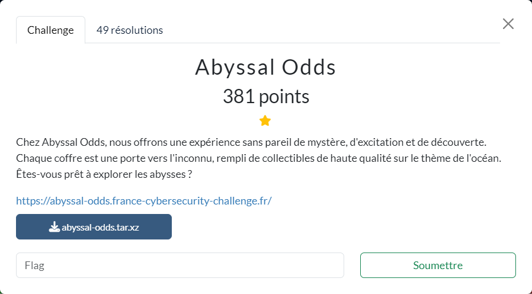

# Abyssal Odds



Les fichiers fournis :
- [abyssal-odds.tar.xz](abyssal-odds.tar.xz)

----

### 1. Objectif du challenge

Le site fourni permet de collectionner 8 trésors différents.

Pour agrandir notre collection on dispose au départ de 1000 coquillages, avec la possibilité d'acheter des trésors valant chacun 125 coquillages. Par conséquent, si on se débrouille bien on doit pouvoir acquérir l'intégralité de la collection. Mais après quelques tests on déchante rapidement.

L'analyse du code permet de confirmer que l'objectif du challenge est bien d'arriver à obtenir une collection complète.

On voit d'après le template `src/templates/collection.hbs` que le flag doit s'afficher sur la page `/collection` :

```hbs
{{#if flag}}<div class="text-3xl text-amber-600 font-thin font-mono mb-4">{{flag}}</div>{{/if}}
```
La condition d'affichage étant définie dans `src/routes/collection.ts` :

```ts
const count = event.session.collection.size;
const flag = count === fullCollection.length && (process.env.FLAG || "FCSC{flag}");
return renderTemplate(event, "collection", { collection, flag });
```

----

### 2. Comment choisir le trésor ?

Maintenant, voyons si on peut agir sur le choix du trésor.

En analysant un peu plus le comportement, et le code, on s'aperçoit que le choix du trésor est implémenté dans la fonction `_openBox` de `src/utils/collection.ts` :

```ts
export const fullCollection = [
  { name: "Ocean Pearl Bivalve", img: "/mussle.webp" },
  { name: "Royal Crustacean", img: "/crab.webp" },
  { name: "Luminescent Medusa", img: "/jellyfish.webp" },
  { name: "Sovereign Cephalopod", img: "/octopus.webp" },
  { name: "Coral Reef Specter", img: "/shrimp.webp" },
  { name: "Celestial Seastar", img: "/star.webp" },
  { name: "Majestic Chelonian", img: "/turtle.webp" },
  { name: "Treasure Trove", img: "/molluscs.webp" },
] as const;

function _openBox(box: LootBox, key: number) {
  const ts = Math.floor(Date.now() / 1000);
  switch (true) {
    case key === box.seed:
      return 1;
    case Math.abs(key - ts) < 60:
      return 2;
    case box.seed % key === 0:
      return 3;
    case Math.cos(key) * 0 !== 0:
      return 4;
    case key && (box.seed * key) % 1337 === 0:
      return 5;
    case key && (box.seed | key) === (box.seed | 0):
      return 6;
    case !(key < 0) && box.seed / key < 0:
      return 7;
    default:
      return 0;
  }
}
```

Cette fonction est déclenchée lorsqu'on clique sur le bouton **Open The Box** déclenchant la requête suivante :

```http
POST /open HTTP/1.1
Content-Type: application/x-www-form-urlencoded
Cookie: session_id=dcb4798821bb6eed; csrf_token=ef7a9b87d36c4968

csrf_token=ef7a9b87d36c4968&key=17985091&boxId=106e235b83a5ce74&action=open
```

Le choix du trésor dépend donc des éléments suivants :
- `key` : fourni dans la requête `/open`
- `ts` : un timestamp calculé au moment où la requête est exécutée
- `box.seed` : défini côté serveur lors de l'appel à `/buy` (quand on décide d'acheter un trésor) et généré aléatoirement.

----

### 3. Obtention des trésors

#### 3.1 Trésor 2 - Luminescent Medusa

Pour l'obtenir il faut que la condition suivante soit vérifiée :

```ts
// avec : ts = Math.floor(Date.now() / 1000);
Math.abs(key - ts) < 60
```

`ts` étant donc le nombre de secondes depuis le 1/1/1970, il suffit de calculer `key` de façon similaire. La marge de 60s est suffisante pour remplir la condition.

----

#### 3.2. Trésor 3 - Sovereign Cephalopod

Ici il faut que :

```ts
box.seed % key === 0:
```

Quelle que soit la valeur de `box.seed` elle est multiple de `1`.

----

#### 3.3. Trésor 4 - Coral Reef Specter

Il faut faire en sorte que :

```ts
Math.cos(key) * 0 !== 0
```

En mulitpliant `NaN` et `0`, on obtient `NaN`. Pour obtenir `NaN` avec `Math.cos()`, il suffit de prendre `Infinity`.

----

#### 3.4. Trésor 5 - Celestial Seastar

Il faut faire en sorte que :

```ts
key && (box.seed * key) % 1337 === 0
```

`key` ne pouvant pas être `0`, il faut donc que l'autre condition le soit. Pour cela il suffit de prendre un multiple de `1337` pour `key` car dans ce cas, le reste de la division euclidienne est nul.

----

#### 3.5. Trésor 6 - Majestic Chelonian

Il faut faire en sorte que :

```ts
key && (box.seed | key) === (box.seed | 0)
```

`key` ne pouvant pas être `0`, il faut donc que `(box.seed | key) === (box.seed | 0)`.

Si une des 2 opérandes de `|` est un entier de 32 bits, alors l'autre est éventuellement aussi converti en un entier de 32 bits (i.e. seuls les "derniers 32 bits" sont conservés).

`box.seed` a au plus 32 bits, car défini via la fonction `randomNumber` :

```ts
export function randomNumber() {
  return Math.floor(Math.random() * 0xffffffff);
}
```

Donc la condition à obtenir est : `(box.seed | key) === box.seed`

Or `0xffffffff + 1` = `0x100000000`. Si on prend ses derniers 32 bits on a : `0x00000000` soit `0`, permettant donc de remplir la condition.

----

#### 3.6. Trésor 7 - Treasure Trove

Il faut faire en sorte que :

```ts
!(key < 0) && box.seed / key < 0
```

Avec `key` = `-0` la condition est valide.

----

#### 3.7. Trésor 0 - Ocean Pearl Bivalve

C'est le cas par défaut. N'importe quelle valeur devrait faire l'affaire à condition de ne pas rentrer dans les autres cas. Arbitrairement, on peut prendre `111111`.

----

#### 3.8. Trésor 1 - Royal Crustacean

Il faut faire en sorte que :

```ts
key === box.seed
```

Cela veut dire arriver à prédire la valeur de `box.seed`.

----

### 4. Obtention du trésor 1 - Royal Crustacean

Pour arriver à prédire la valeur de `box.seed`, il faut arriver à prédire la valeur qui va être retournée par l'appel à `Math.random()`.

La documentation de [`Math.random()`](https://developer.mozilla.org/en-US/docs/Web/JavaScript/Reference/Global_Objects/Math/random) indique que cette fonction n'est pas sure, car en effet elle est prédictive. On peut ainsi trouver des articles et des POC montrant comment, à partir de quelques valeurs obtenues par l'appel à `Math.random()`, il est possible de prédire les suivantes.

Par conséquent, l'étape suivante consiste à rechercher des possibles fuites de ces valeurs.

On se rend alors compte que `Math.random()` est utilisé pour :
- définir la valeur du cookie `session_id`
    - 2 appels sont effectués à cette occasion
- définir la valeur du token anti-crsr `csrf_token`
    - ici aussi 2 appels sont effectués
- définir un `nonce` présent dans le DOM de la page `/buy` :
    ```html
    <script nonce="4909d7dafb86bf86" src="https://cdn.tailwindcss.com"></script>
    ```
    - 2 appels sont effectués
    - A noter que le clic sur le bouton **Open The Box** renvoyant sur cette même page, 2 autres appels sont alors effectués à cette occasion
- définir l'identifiant de la boite `boxId` que l'on va acheter avant son ouverture. La donnée est présente aussi dans le DOM de `/buy` en retour du formulaire envoyé (i.e. suite au clic sur **Open The Box**)
- définir le `box.seed`

On est donc en capacité de collecter suffisamment de valeurs successives issues de `Math.random()` pour mettre en place une prédiction de `box.seed`

----

### 5. Exploitation

Le script [`abyssal-solve.py`](./abyssal-solve.py) permet d'interagir avec le site afin de collecter les différents trésors et au final obtenir le flag.

NB : La partie prédictive est implémentée dans [`xs128p.py`](./xs128p.py) issu du POC [v8_rand_buster](https://github.com/d0nutptr/v8_rand_buster/blob/master/README.md)

Voici le résultat d'une exécution du script :

```sh
$ python3 abyssal-solve.py REMOTE
csrf_token='3ffac6c77a16dc9e'
=======================================
= cas 6
box_id='ba8e3c9930ce71f0'
box_name='Majestic Chelonian'
Majestic Chelonian ... OK
=======================================
= cas 2
box_id='a15a1d93a876c675'
box_name='Luminescent Medusa'
Luminescent Medusa ... OK
=======================================
= cas 3
box_id='154d7f49114b5666'
box_name='Sovereign Cephalopod'
Sovereign Cephalopod ... OK
=======================================
= cas 4
box_id='3ef2b7fe05178031'
box_name='Coral Reef Specter'
Coral Reef Specter ... OK
=======================================
= cas 5
box_id='13d54cda8c022a3e'
box_name='Celestial Seastar'
Celestial Seastar ... OK
=======================================
= cas 7
box_id='7e39647124a2d499'
box_name='Treasure Trove'
Treasure Trove ... OK
=======================================
= cas default
box_id='b66f94d1e5bf5081'
box_name='Ocean Pearl Bivalve'
Ocean Pearl Bivalve ... OK
nonce='9c8a8dfb84d61af4' -> 2626326011, 2228624116
nonce='df3e498da34565f0' -> 3745401229, 2739234288
nonce='adc6ada21ea2f020' -> 2915478946, 513994784
nonce='10f9d747b31ca579' -> 284809031, 3004999033
nonce='5b0a19f171b4d132' -> 1527388657, 1907675442
nonce='11b7c476bb008db5' -> 297256054, 3137375669
[2626326011, 2228624116, 3745401229, 2739234288, 2915478946, 513994784, 284809031, 3004999033, 1527388657, 1907675442, 297256054, 3137375669]
nonce='008b5154457587fd' -> 9130324, 1165330429
box_id='702b5e6b9dcd4d50'
nonce='702b5e6b9dcd4d50' -> 1881890411, 2647477584
[2626326011, 2228624116, 3745401229, 2739234288, 2915478946, 513994784, 284809031, 3004999033, 1527388657, 1907675442, 297256054, 3137375669, 9130324, 1165330429, 1881890411, 2647477584]
prediction=975606703
box_name='Royal Crustacean'
Royal Crustacean ... OK
=======================================
= collection = 8 element(s)
- Ocean Pearl Bivalve
- Royal Crustacean
- Luminescent Medusa
- Sovereign Cephalopod
- Coral Reef Specter
- Celestial Seastar
- Majestic Chelonian
- Treasure Trove
flag=['FCSC{1f007a2f9522ba392d045049fbf07504fa3cabf2c78c32f9b3ab2fd905653cca}']
```
