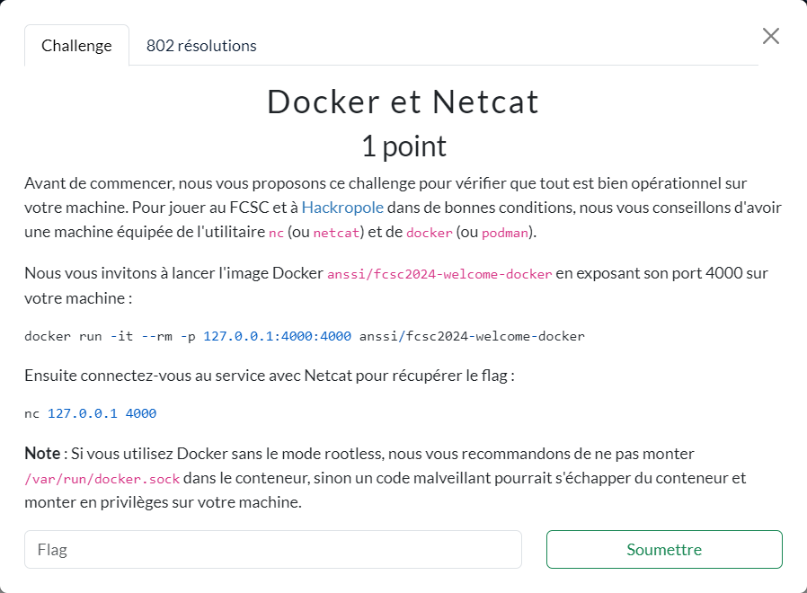

# Docker et Netcat



----

En lançant le container (dans une 1ère console) et en se connectant au port exposé par celui-ci (dans une 2ème console), on obtient le flag.

```sh
# Console 1
{ FCSC }  »  docker run -it --rm -p 127.0.0.1:4000:4000 anssi/fcsc2024-welcome-docker
[2024-04-05T13:47:25Z INFO  ctf_wrapper] Listening on 0.0.0.0:4000
[2024-04-05T13:47:41Z INFO  ctf_wrapper] Client 172.17.0.1:46484 connected
[2024-04-05T13:47:41Z INFO  ctf_wrapper] Client 172.17.0.1:46484 disconnected

# Console 2
{ FCSC }  » nc localhost 4000

 #######  #####   #####   #####      #####    ###    #####  #
 #       #     # #     # #     #    #     #  #   #  #     # #    #
 #       #       #       #                # #     #       # #    #
 #####   #        #####  #           #####  #     #  #####  #    #
 #       #             # #          #       #     # #       #######
 #       #     # #     # #     #    #        #   #  #            #
 #        #####   #####   #####     #######   ###   #######      #
Here is your flag: FCSC{cc4672dc4e2bd5eb50bb98ee0e8bb2e992e6003baea4e06deeae7a08c4966d96}
```
