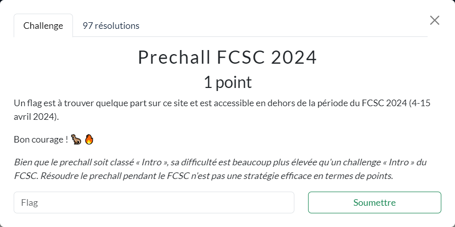
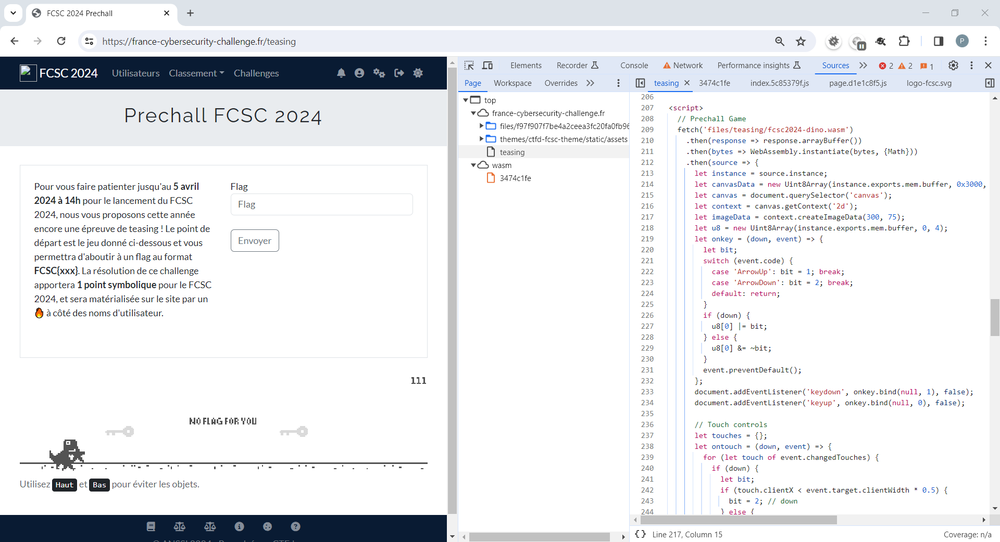

# Prechall FCSC 2024



----

### Etape 1 : Trouver le challenge

Le code source de la page d'accueil https://france-cybersecurity-challenge.fr/ contient une URL qui est vraisemblablement celle du pré-challenge :


----

### Etape 2 : Reverse WASM

Le contenu de la page https://france-cybersecurity-challenge.fr/teasing confirme cette hypothèse :



On y retrouve une adaptation du fameux jeu [T. Rex Game](https://fr.wikipedia.org/wiki/T._Rex_Game) disponible sous Chrome (et accessible via `chrome://dino`)

L'analyse des sources de la page montre que celle-ci est principalement constituée :
- d'une page HTML, avec une partie JS qui contrôle le jeu
- d'un code WASM, qui contient la logique du jeu

La partie JS qui interagit avec le WASM est la suivante :

```js
// Prechall Game
fetch('files/teasing/fcsc2024-dino.wasm')
  .then(response => response.arrayBuffer())
  .then(bytes => WebAssembly.instantiate(bytes, {Math}))
  .then(source => {
    let instance = source.instance;
    let canvasData = new Uint8Array(instance.exports.mem.buffer, 0x3000, 90000);
    let canvas = document.querySelector('canvas');
    let context = canvas.getContext('2d');
    let imageData = context.createImageData(300, 75);
    let u8 = new Uint8Array(instance.exports.mem.buffer, 0, 4);
    let onkey = (down, event) => {
      let bit;
      switch (event.code) {
        case 'ArrowUp': bit = 1; break;
        case 'ArrowDown': bit = 2; break;
        default: return;
      }
      if (down) {
        u8[0] |= bit;
      } else {
        u8[0] &= ~bit;
      }
      event.preventDefault();
    };
    document.addEventListener('keydown', onkey.bind(null, 1), false);
    document.addEventListener('keyup', onkey.bind(null, 0), false);

    // Touch controls
    let touches = {};
    let ontouch = (down, event) => {
      for (let touch of event.changedTouches) {
        if (down) {
          let bit;
          if (touch.clientX < event.target.clientWidth * 0.5) {
            bit = 2; // down
          } else {
            bit = 1; // up
          }
          u8[0] |= bit;
          touches[touch.identifier] = bit;
        } else {
          u8[0] &= ~touches[touch.identifier];
          delete touches[touch.identifier];
        }
      }
      event.preventDefault();
    };
    canvas.addEventListener('touchstart', ontouch.bind(null, 1), false);
    canvas.addEventListener('touchend', ontouch.bind(null, 0), false);

    (function update() {
      requestAnimationFrame(update);
      instance.exports.run();
      imageData.data.set(canvasData);
      context.putImageData(imageData, 0, 0);
    })();
  });
```

On en déduit :
- que des données sont échangées entre la partie JS et WASM via la mémoire `instance.exports.mem.buffer`
- la plage [`0x3000`, `0x3000+90000`[ sert à construire l'image en 2D du jeu
- la plage [`0`, `4`[ sert à transmettre les interactions utilisateurs (faire sauter ou se baisser dino)
- le déclenchement de la mise à jour de l'image s'effectue via la fonction `run()` WASM (cf. appel à `instance.exports.run()` dans le JS)

Chrome décompile automatiquement le WASM (format binaire) et en propose une version WAT (format texte), dont en voici une synthèse :

```wasm
(module
  (func $f (;0;) (import "Math" "random") (result f32))
  (memory $mem (;0;) (export "mem") 2)
  (global $a (;0;) (mut i32) (i32.const 0))
  (global $b (;1;) (mut i32) (i32.const 0))
  (global $c (;2;) (mut i32) (i32.const 0))
  (global $d (;3;) (mut f32) (f32.const 0.0))
  (global $e (;4;) (mut f32) (f32.const -0.5))
  (func $g (;1;) (param $x (;0;) i32) (param $y (;1;) i32) (param $w (;2;) i32) (param $h (;3;) i32) (param $i (;4;) i32) (param $j (;5;) i32) (result i32) ... )
  (func $h (;2;) (param $num (;0;) i32) (param $x (;1;) i32) (param $y (;2;) i32) ... 
  (func $run (;3;) (export "run") ... )
  (data (i32.const 4) "\01\00 ... ")
)
```

Le code est assez obscur de prime abord.

Est-ce qu'une version décompilée ne serait-elle pas plus lisible ?

Pour cela on peut utiliser les outils du [WABT](https://github.com/WebAssembly/wabt) sur le fichier `fcsc2024-dino.wasm` :

```sh
# Installation du package
sudo apt install wabt
# Décompilation en une syntaxe similaire au C
wasm-decompile fcsc2024-dino.wasm -o fcsc2024-dino.wasm.c
# Pour en obtenir le format WAT
wasm2wat fcsc2024-dino.wasm -o fcsc2024-dino.wasm.wat
```

Le code n'en est pas beaucoup plus clair, cependant, associé à une exécution en debug dans le navigateur, on en déduit :
* que `c=3`, correspond au cas où on a perdu
* la fonction `$h()` semble utilisée pour afficher le score
* la variable globale `b` correspond au score qui est incrémenté régulièrement :
    - `b = b + 1` dans le fichier [`fcsc2024-dino.wasm.c`](./fcsc2024-dino.wasm.c)
    - et la correspondance dans le fichier [`fcsc2024-dino.wasm.wat`](./fcsc2024-dino.wasm.wat)
      ```wasm
      global.get $b
      i32.const 1
      i32.add
      global.set $b
      ```
* quand le score `b` atteint `500000000` il se passe visiblement quelque chose :
    ```c
    if (500000000 < b) { g(5, 5, 33, 33, -1409286144, 1260) }
    ```

----

### Etape 3 : Modification du WASM

Comme il ne semble pas possible d'utiliser la fonctionnalité d'override de Chrome sur un WASM, on va le faire à partir de ressources en local.

La 1ère étape consiste à effectuer un web-scraping de la page du pré-challenge. Un exemple de contenu ainsi récupéré est disponible [ici](./web-scraping/)

Puis à démarrer un Serveur Web (par exemple celui de Python) pour en servir les ressources :

```sh
python3 -m http.server -d web-scraping
```

Le contenu est alors accessible via l'URL http://localhost:8000/FCSC_2024_Prechall.html

Maintenant que l'application fonctionne en local, on peut modifier à loisir le WASM.

La façon la plus simple pour que le score dépasse les fameux `500000000`, il suffit d'initialiser le score à cette valeur au lieu de `0`.

Voici le diff correspondant aux modifications effectuées sur le WAT afin d'en obtenir une version patchée [`fcsc2024-dino-patched.wasm.wat`](./fcsc2024-dino-patched.wasm.wat) :

```diff
-  (global $b (mut i32) (i32.const 0))
+  (global $b (mut i32) (i32.const 500000000))
```

A partir du WAT, on récupère le WASM correspondant :

```sh
wat2wasm fcsc2024-dino-patched.wasm.wat -o fcsc2024-dino-patched.wasm
```

On l'utilise à la place du précédant, et on rafraichit la page :


Un QRcode apparait alors à l'écran, dont le contenu correspond à une URL : https://france-cybersecurity-challenge.fr/bded79a9edb3e51a1d752c5ea6dfae1a

----

### Etape 4 : Reverse Pyhton

Cette nouvelle page contient un script python :


Que l'on peut extraire par exemple dans un fichier [`prechall_step2.py`](./prechall_step2.py)

On voit que le script :
* propose de saisir une chaine de caractères
* applique sur celle-ci une suite de tests (cf. les `assert`)
* et si toutes les vérifications sont OK, calcule le SHA-256 de la chaine
* Ce hash sert ensuite à constituer une nouvelle URL, qui devrait constituer l'étape suivante du pré-challenge.

Le script [`prechall_step2_reverse.py`](./prechall_step2_reverse.py) commence à reconstituer la chaine, puis à appliquer l'algorithme afin de la valider.

```sh
{ fcsc2024 }  » python3 prechall_step2_reverse.py
...
>>> $ABFIZht!HPUYhirKOXdhjxy?DGJSWehCENahklo*cghmpu€MQRVfhvzLTbhnqsw!FOWamwzFRSTUdlp*EFVXbei?FMNPgjsCDFHcnvxFJQYkqy€FGKLforu$Rcejkrw!$?TVox€$DMUabuy$JKilmsv$EGOPQnp$*HNWdfq$CLSXYgzDIKNVYpw*CIJMOTr!GIbdgkvIQUWXcosISafijn€IPelquxz?EHILRmyGHMXltw€ETWYjtuvNQSbmrtx!Cefpsty*?KUkntzDORgioqtJLPVacdt*APSovwyAHKQTaeg?AOYbcflADEdrsz€!AJNRXnuACGUVjmqALMWikpx?BCQdiuwBDPTXfkmBHJbjopz*BGRYasxBVWglnry!BEKMScqBLNOUev€EJUZfgwxGNTZciyzCKPRWZb€HOSVZksuMYZdemno?XZapqrv!*DLQZjl
Congrats! You can now go here: https://france-cybersecurity-challenge.fr/b476ca7cd889ee0d2de7db528f2cc094329be7da417d10a24a808997825fff90
```

On peut se rendre à l'URL proposée : https://france-cybersecurity-challenge.fr/b476ca7cd889ee0d2de7db528f2cc094329be7da417d10a24a808997825fff90

----

### Etape 5 : le flag

En suivant cette nouvelle URL, on voit apparaître le flag sur la page :


Le flag est donc : `FCSC{892e99c79e21dc688583812d93064773609e6ce39cc37cae2d17da9a5535d1a6}`
